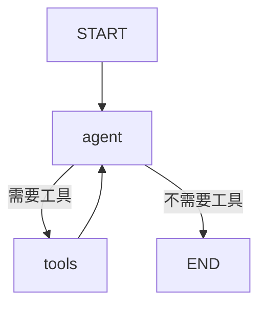

## LangGraph 的诞生背景与架构全景

### LLM 应用编排的演进史

在理解 LangGraph 之前，我们需要回顾 LLM 应用编排框架的演进历程。这个演进本质上是 **"如何让 LLM 应用的控制流从线性走向复杂"** 的过程。

**第一阶段：Prompt 模板 + API 调用（2022 年）**

最初的 LLM 应用极其简单——写一个 prompt 模板，调用 OpenAI API，获取结果。这适合单轮问答，但无法处理多步推理。
```python
# 2022年的典型LLM应用
import openai
response = openai.ChatCompletion.create(
    model="gpt-3.5-turbo",
    messages=[{"role": "user", "content": "翻译：Hello World"}]
)
```

<!-- more -->

**第二阶段：LangChain Chain（2022 年底 - 2023 年初）**

LangChain 引入了 Chain 概念，将多个步骤串联为线性流程。`LLMChain`、`SequentialChain`、`RouterChain` 是这个时代的代表。

```python
# LangChain Chain：线性编排
chain = prompt | llm | output_parser
result = chain.invoke({"input": "Hello"})
```

**Chain 的局限性**：

- **线性结构**：只能从头到尾执行，不支持循环（ReAct Agent 的核心需求就是循环）
- **无状态**：每次调用都是独立的，无法实现记忆
- **无持久化**：崩溃后无法恢复
- **无中断**：无法在执行中间插入人工审核

**第三阶段：LangChain Agent + Tool（2023 年）**

LangChain 引入了 Agent，通过 `AgentExecutor` 实现了"LLM 思考 → 调用工具 → 继续思考"的循环。这是一个巨大的进步，但 `AgentExecutor` 本质上是一个**硬编码的 while 循环**：

```python
# AgentExecutor 的简化内部逻辑
while True:
    action = llm.decide(messages)
    if action.type == "tool_call":
        result = tools[action.name](action.args)
        messages.append(tool_result(result))
    else:
        break  # 返回最终答案
```

**AgentExecutor 的局限性**：

- 循环逻辑硬编码，无法自定义（比如想要 "思考 → 搜索 → 反思 → 重新搜索" 就很困难）
- 无法并行执行多个工具
- 无法实现多 Agent 协作
- 状态管理不够灵活

**第四阶段：LangGraph（2024 年初至今）**

LangGraph 的诞生正是为了解决上述所有问题。它的核心洞察是：**任何复杂的 LLM 工作流，都可以建模为有向图**。

### 为什么选择图？

图论在计算机科学中有着悠久的历史。Google 的 PageRank 用图对网页重要性排序；Pregel 用图做大规模分布式计算；网络协议用有限状态机（FSM）描述状态转换。
LangGraph 选择图作为 LLM 应用的编排模型，是因为：

| 需求 | 线性 Chain | 树状 Chain | **有向图（LangGraph）** |
|------|-----------|-----------|----------------------|
| 循环执行 | ❌ | ❌ | ✅ |
| 条件分支 | 有限 | ✅ | ✅ |
| 并行执行 | ❌ | ❌ | ✅（超级步内） |
| 状态持久化 | ❌ | ❌ | ✅（Checkpoint） |
| 可中断恢复 | ❌ | ❌ | ✅（Human-in-the-Loop） |
| 动态分支 | ❌ | ❌ | ✅（Send） |
| 子图嵌套 | ❌ | ❌ | ✅（Subgraph） |

### LangGraph 与竞品对比

在 2024-2026 年间，出现了多个 Agent 编排框架。以下是 LangGraph 与主流竞品的对比：

**LangGraph vs CrewAI**：

- CrewAI 是**高层框架**，专注于角色扮演式多 Agent（每个 Agent 有角色、目标、背景故事），适合快速构建故事驱动的协作系统。
- LangGraph 是**低层框架**，提供精细的图级控制，适合需要精确控制执行流程的生产系统。
- CrewAI 底层不使用 Pregel，无法实现复杂的循环和并行。

**LangGraph vs AutoGen**：

- AutoGen（微软）是**对话驱动**的多 Agent 框架，Agent 之间通过消息传递协作。
- AutoGen 适合研究和原型开发，但缺乏生产级的持久化和部署支持。
- LangGraph 提供完整的持久化、流式、部署方案。

**LangGraph vs LlamaIndex Workflows**：

- LlamaIndex Workflows 是基于事件驱动的工作流引擎，适合 RAG 管道编排。
- 但不支持循环图和 Pregel 模型，在 Agent 场景下不如 LangGraph 灵活。

总结：如果你的需求是"精细控制 + 生产部署"，LangGraph 是目前最成熟的选择。

### LangGraph 生态全景

LangGraph 不仅仅是 `libs/langgraph` 这个核心库，它是一个完整的生态系统：

```bash
langgraph/
├── libs/
│   ├── langgraph/          # 核心库（StateGraph、Pregel、Channels）
│   ├── prebuilt/           # 预构建组件（create_react_agent、ToolNode）
│   ├── checkpoint/         # 基础检查点抽象（BaseCheckpointSaver）
│   ├── checkpoint-postgres/# PostgreSQL 持久化
│   ├── checkpoint-sqlite/  # SQLite 持久化
│   ├── checkpoint-conformance/  # 检查点一致性测试
│   ├── sdk-py/             # Python SDK（LangGraph Platform 集成）
│   ├── sdk-js/             # JavaScript SDK
│   ├── cli/                # 命令行工具
│   └── managed/            # 托管服务集成
├── docs/                   # 文档
└── examples/               # 示例项目
```

**核心库 `langgraph` 的模块结构**（源码位于 `libs/langgraph/langgraph/`）：

```bash
langgraph/
├── __init__.py
├── constants.py            # START, END 常量
├── errors.py               # GraphError, InvalidUpdateError 等
├── config.py               # 配置管理
├── types.py                # 类型定义
├── typing.py               # 类型工具
├── version.py              # 版本号
├── runtime.py              # 运行时配置
├── callbacks.py            # 回调机制
├── warnings.py             # 警告
│
├── channels/               # 通道系统（状态存储的底层实现）
│   ├── base.py             # BaseChannel 抽象基类
│   ├── last_value.py       # LastValue 通道
│   ├── topic.py            # Topic 通道（支持多订阅者）
│   ├── binop.py            # BinaryOperatorAggregate 通道
│   ├── ephemeral_value.py  # EphemeralValue 通道
│   ├── named_barrier_value.py  # NamedBarrierValue 通道
│   ├── untracked_value.py  # UntrackedValue 通道
│   └── any_value.py        # AnyValue 通道
│
├── graph/                  # 图构建 API
│   ├── state.py            # StateGraph（1752行，最核心文件）
│   ├── message.py          # MessageGraph, add_messages
│   ├── _node.py            # 节点辅助函数
│   ├── _branch.py          # 条件分支逻辑
│   └── ui.py               # 可视化辅助
│
├── pregel/                 # Pregel 执行引擎
│   ├── main.py             # Pregel 类（编译后的图执行入口）
│   ├── _loop.py            # 主执行循环
│   ├── _algo.py            # 算法核心（prepare_next_tasks等）
│   ├── _write.py           # 写入逻辑（应用 writes 到 channels）
│   ├── _read.py            # 读取逻辑（从 channels 读取状态）
│   ├── _runner.py          # 任务运行器
│   ├── _executor.py        # 执行器（并行执行）
│   ├── _checkpoint.py      # 检查点处理
│   ├── _config.py          # 执行配置
│   ├── _call.py            # 调用接口（invoke/astream等）
│   ├── _io.py              # 输入输出处理
│   ├── _validate.py        # 图验证
│   ├── _draw.py            # 图绘制
│   ├── _log.py             # 日志
│   ├── _retry.py           # 重试策略
│   ├── _messages.py        # 消息处理
│   ├── _utils.py           # 工具函数
│   ├── protocol.py         # 协议定义
│   ├── remote.py           # 远程执行
│   ├── debug.py            # 调试工具
│   └── types.py            # Pregel 内部类型
│
├── func/                   # 函数式 API
├── managed/                # 托管服务
├── utils/                  # 通用工具
└── _internal/              # 内部工具
```

### LangGraph 的设计哲学

理解 LangGraph 的设计哲学，有助于你更好地使用它：

1. **显式优于隐式**：所有状态转换都是显式的（通过节点返回值和边），没有"魔法"。
2. **组合优于继承**：通过组合节点、边、子图来构建复杂系统，而不是继承基类。
3. **可观测性内置**：每一步执行都可以被追踪（通过 LangSmith）。
4. **容错性优先**：Checkpoint 机制确保任何时刻都可以恢复。
5. **类型安全**：通过 TypedDict 和 Annotated 提供编译时类型检查。

## 环境搭建与快速入门

### 安装

```bash
# 核心安装
pip install -U langgraph langchain langchain-openai
# 可选：持久化后端
pip install langgraph-checkpoint-postgres   # PostgreSQL
pip install langgraph-checkpoint-sqlite     # SQLite
# 可选：可视化
pip install matplotlib
# 可选：开发者工具
pip install langgraph-cli                   # LangGraph CLI
pip install langgraph-sdk                   # LangGraph Platform SDK
```

验证安装：

```python
import langgraph
print(langgraph.__version__)  # 应显示版本号
from langgraph.graph import StateGraph, START, END
from langgraph.pregel import Pregel
print("LangGraph 核心组件加载成功")
```

### 环境配置

```python
import os
# OpenAI API Key
os.environ["OPENAI_API_KEY"] = "sk-your-api-key"
# 可选：LangSmith 追踪（强烈推荐用于学习和调试）
os.environ["LANGCHAIN_TRACING_V2"] = "true"
os.environ["LANGCHAIN_API_KEY"] = "your-langsmith-key"
os.environ["LANGCHAIN_PROJECT"] = "langgraph-tutorial"
# 可选：LangGraph Platform（用于部署）
os.environ["LANGCHAIN_API_KEY"] = "your-api-key"
```

### 第一个图：Hello World

在深入概念之前，让我们先构建一个最简单的图，建立直觉：
```python
from langgraph.graph import StateGraph, START, END
from typing import TypedDict
# 步骤1：定义状态
class MyState(TypedDict):
    greeting: str
# 步骤2：定义节点（纯函数）
def greet(state: MyState) -> dict:
    return {"greeting": f"你好，{state['greeting']}！"}
def farewell(state: MyState) -> dict:
    return {"greeting": f"{state['greeting']}，再见！"}
# 步骤3：构建图
builder = StateGraph(MyState)
builder.add_node("greet", greet)
builder.add_node("farewell", farewell)
# 步骤4：添加边（定义执行流）
builder.add_edge(START, "greet")        # 从入口到 greet 节点
builder.add_edge("greet", "farewell")   # 从 greet 到 farewell
builder.add_edge("farewell", END)       # 从 farewell 到结束
# 步骤5：编译并运行
graph = builder.compile()
result = graph.invoke({"greeting": "世界"})
print(result)  # {'greeting': '你好，世界！，再见！'}
```

**执行流程图**：

```
START → [greet] → [farewell] → END
```

这个例子虽然简单，但已经展示了 LangGraph 的所有核心要素：

- **State**（状态）：`MyState` 定义了图中的共享数据
- **Node**（节点）：`greet` 和 `farewell` 是执行单元
- **Edge**（边）：定义了节点间的执行顺序
- **Compile**（编译）：将图定义转换为可执行对象

### 用图形化思维理解 LangGraph

LangGraph 的核心隐喻是"图"。在写代码之前，你应该先用图形化的方式思考你的应用：

**方法 1：纸笔画图**

```
用户输入 → [Agent 思考] → 需要工具？
                           ├── 是 → [工具执行] → 回到 [Agent 思考]
                           └── 否 → [输出结果] → 结束
```

**方法 2：Mermaid 语法**



**方法 3：代码可视化**（LangGraph 内置）

```python
from IPython.display import Image, display
# 编译后可以获取图结构
graph = builder.compile()
display(Image(graph.get_graph().draw_mermaid_png()))
# 或者获取 Mermaid 代码
print(graph.get_graph().draw_mermaid())
```


## 核心概念详解

### State（状态）—— 图的共享记忆

State 是 LangGraph 中最基础也是最重要的概念。图中的所有节点共享同一个 State，节点通过读写 State 来通信。

#### State 的本质

State 是一个 **TypedDict**（或 dataclass），它的每个字段对应一个 **Channel**。当你在 State 中定义一个字段时，LangGraph 会自动为它创建一个 Channel 来存储和更新数据。

```python
from typing import TypedDict, Annotated
from operator import add
class State(TypedDict):
    messages: Annotated[list, add]    # 对应 Topic Channel（追加模式）
    count: int                         # 对应 LastValue Channel（覆盖模式）
    is_complete: bool                  # 对应 LastValue Channel（覆盖模式）
```

**关键理解**：State 不是简单的 Python 字典。当你执行 `graph.invoke(input_state)` 时，LangGraph 会：

1. 根据 State schema 为每个字段创建对应的 Channel 实例
2. 将 input_state 写入对应的 Channel
3. 每次节点执行后，节点的返回值会被写入 Channel（通过 reducer 合并）
4. 最终，从所有 Channel 中读取最终值作为结果

#### Annotated 与 Reducer

`Annotated[type, reducer]` 是 LangGraph 状态系统的核心机制：

- **`type`**：字段的数据类型
- **`reducer`**：定义了当多个节点同时写入同一个字段时，如何合并这些写入

源码中，reducer 的注册发生在 `graph/state.py` 的 `_get_channel_namespace` 函数中。当 StateGraph 解析 TypedDict 的类型注解时，它会检查是否有 `Annotated`，如果有，提取 reducer 函数并创建对应的 Channel。

**默认 Reducer（last_value）**：

如果没有指定 reducer，LangGraph 使用 `last_value`（最后一个写入的值覆盖之前的值）：

```python
class State(TypedDict):
    current_step: str    # 默认 reducer = last_value
    result: str          # 默认 reducer = last_value
```

如果节点 A 返回 `{"current_step": "A"}`，节点 B 返回 `{"current_step": "B"}`，最终 `current_step` 的值是 
`"B"`。

**`add` Reducer（累加）**：

```python
from operator import add
from typing import Annotated
class State(TypedDict):
    numbers: Annotated[list[int], add]
    total: Annotated[int, add]
```

如果节点 A 返回 `{"numbers": [1, 2], "total": 3}`，节点 B 返回 `{"numbers": [3, 4], "total": 7}`，最终结果是 `{"numbers": [1, 2, 3, 4], "total": 10}`。

**`add_messages` Reducer（智能消息追加）**：

这是 LLM 应用中最常用的 reducer。`add_messages` 不仅仅做追加，它还能处理消息去重和消息更新：

```python
from langgraph.graph.message import add_messages
from langchain_core.messages import BaseMessage, HumanMessage, AIMessage
class State(TypedDict):
    messages: Annotated[list[BaseMessage], add_messages]
```

`add_messages` 的智能行为（源码在 `graph/message.py`）：

```python
# add_messages 的核心逻辑（简化版）
def add_messages(left: list, right: list | dict) -> list:
    """
    - 如果 right 是 list，追加到 left
    - 如果 right 是 dict，且包含 "id" 键：
      - 如果 left 中有相同 id 的消息，则替换
      - 否则追加
    """
    if isinstance(right, dict):
        # 按 id 去重/更新
        left_ids = {m.id for m in left if hasattr(m, 'id')}
        result = list(left)
        for msg in right.get("messages", []):
            if msg.id in left_ids:
                result = [m if m.id != msg.id else msg for m in result]
            else:
                result.append(msg)
        return result
    else:
        return left + right
```

**自定义 Reducer**：

你可以编写任意 reducer 函数：

```python
def max_reducer(current: int, update: int) -> int:
    """保留最大值"""
    if current is None:
        return update
    return max(current, update)
def unique_append(current: list, update: list) -> list:
    """去重追加"""
    if current is None:
        return update
    result = list(current)
    for item in update:
        if item not in result:
            result.append(item)
    return result
class State(TypedDict):
    max_score: Annotated[int, max_reducer]
    unique_items: Annotated[list[str], unique_append]
```

#### MessagesState 预构建状态

LangGraph 提供了一个最常用的预构建状态：

```python
from langgraph.graph import MessagesState
# 等价于：
# class MessagesState(TypedDict):
#     messages: Annotated[list[BaseMessage], add_messages]
```

#### State 的设计原则

1. **最小化字段**：State 中的字段应该尽可能少。每个字段都需要一个 Channel，字段越多，内存和管理开销越大。
2. **用 Annotated 明确 reducer**：即使使用默认 reducer，也建议显式标注，提高代码可读性。
3. **不要在 State 中存储大对象**：State 会被序列化到 checkpoint，大对象会影响性能。

### Node（节点）—— 图的执行单元

节点是图中真正"做事"的部分。每个节点是一个函数，接收当前 State，返回 State 的部分更新。

#### 节点的签名

```python
def my_node(state: MyState) -> dict:
    """
    输入：完整的当前 State
    输出：State 的部分更新（会被 reducer 合并）
    """
    # 读取当前状态
    messages = state["messages"]
    
    # 执行逻辑
    result = some_processing(messages)
    
    # 返回更新（只返回需要更新的字段）
    return {"messages": [result]}
```
**节点规则**：

1. 节点必须接收一个参数（State dict）
2. 节点必须返回一个 dict（State 的部分更新）
3. 节点应该是**纯函数**——不修改输入 state，只返回新的值
4. 节点返回的 dict 的键必须是 State schema 中定义的字段

#### 节点可以返回的内容

```python
# 1. 部分更新（推荐）
def node(state):
    return {"messages": [new_msg]}
# 2. 多字段更新
def node(state):
    return {"messages": [new_msg], "next": "tool_a", "count": 5}
# 3. 不更新任何字段（仅触发副作用）
def node(state):
    print(f"Processing: {state['messages']}")
    return {}  # 返回空字典，state 不变
# 4. 使用 Command 进行高级控制（LangGraph 1.0+）
from langgraph.types import Command, interrupt
def node(state):
    # 请求人工审批
    human_input = interrupt("请确认是否继续")
    return {"messages": [human_input]}
```

#### Runnable 作为节点

节点可以是任何 LangChain Runnable：

```python
from langchain_openai import ChatOpenAI
from langchain_core.prompts import ChatPromptTemplate
llm = ChatOpenAI(model="gpt-4o-mini")
prompt = ChatPromptTemplate.from_template("用中文回答：{question}")
chain = prompt | llm
# 直接将 chain 作为节点
builder.add_node("llm_node", chain)
```

#### 异步节点

LangGraph 完全支持异步：

```python
async def async_node(state: MyState) -> dict:
    import aiohttp
    async with aiohttp.ClientSession() as session:
        async with session.get("https://api.example.com/data") as resp:
            data = await resp.json()
    return {"result": data}
builder.add_node("async_fetch", async_node)
# 运行
result = await graph.ainvoke({"messages": []})
```

### Edge（边）—— 图的控制流

边定义了节点之间的执行顺序。LangGraph 支持多种类型的边。

#### 常规边（无条件）

```python
builder.add_edge("node_a", "node_b")  # node_a 执行完后，执行 node_b
builder.add_edge(START, "node_a")      # 入口边
builder.add_edge("node_b", END)        # 出口边
```

#### 条件边

条件边根据当前 State 的值决定下一步去哪个节点：

```python
def route_based_on_state(state: State) -> str:
    if state["is_complete"]:
        return "end"
    elif state["needs_tool"]:
        return "tools"
    else:
        return "agent"
builder.add_conditional_edges(
    "agent",                  # 源节点
    route_based_on_state,     # 路由函数
    {                         # 路由映射
        "end": END,
        "tools": "tool_node",
        "agent": "agent"       # 可以指向自身，形成循环
    }
)
```

**路由函数的规则**：

1. 接收 State 作为参数
2. 返回一个字符串（目标节点名称）
3. 返回值必须在 path_map 中有对应的键

**简化写法（使用 tools_condition）**：

```python
from langgraph.prebuilt import tools_condition
# tools_condition 是一个预构建的路由函数
# 它检查最后一条消息是否有 tool_calls
# 有 tool_calls → 返回 "tools"
# 没有 → 返回 END
builder.add_conditional_edges("agent", tools_condition)
```

#### Send——动态分支（Map-Reduce）

`Send` 是 LangGraph 中最强大的边类型之一，它允许你在运行时动态创建新的执行分支：

```python
from langgraph.constants import Send
# 场景：并行处理多个主题
def continue_to_summarize(state: State):
    # 根据当前 state 中的 topics，为每个 topic 创建一个 Send
    return [
        Send("summarize_one", {"topic": t, "research": state["research"]})
        for t in state["topics"]
    ]
builder.add_conditional_edges("research", continue_to_summarize)
```

`Send(target_node, state_update)` 的含义：

- `target_node`：目标节点名称
- `state_update`：传递给目标节点的状态片段
当使用 Send 时，Pregel 执行引擎会为每个 Send 创建一个独立的任务，这些任务会在**同一个超级步**中并行执行。

### START 与 END——图的边界

```python
from langgraph.graph import START, END
# START 不是真正的节点，它是图的入口
builder.add_edge(START, "first_node")
# END 也不是真正的节点，它是图的出口
builder.add_edge("last_node", END)
```
**一个图可以有多个 START 边（多个入口），也可以有多个 END 边（多个出口）**：

```python
# 多个入口（所有入口节点在第一个超级步中并行执行）
builder.add_edge(START, "entry_a")
builder.add_edge(START, "entry_b")
# 多个出口
builder.add_conditional_edges("router", route_func, {
    "path_a": "node_a",  # node_a 内部 add_edge(node_a, END)
    "path_b": "node_b",  # node_b 内部 add_edge(node_b, END)
})
```

### Compile（编译）—— 从图定义到可执行对象

`compile()` 是整个构建流程的最后一步。它做了什么？
源码分析（`graph/state.py` 中的 `compile` 方法）：
```python
# StateGraph.compile() 的核心逻辑（简化）
def compile(
    self,
    checkpointer=None,         # 检查点保存器
    interrupt_before=None,     # 在哪些节点之前中断
    interrupt_after=None,      # 在哪些节点之后中断
    debug=False,               # 调试模式
):
    # 1. 验证图的合法性
    #    - 是否所有边都指向已存在的节点
    #    - 是否有不可达的节点
    #    - 条件边的路由函数是否合法
    validate_graph(self)
    
    # 2. 将图结构转换为 Pregel 内部表示
    #    - 将 TypedDict schema 转换为 Channel 定义
    #    - 将节点转换为 PregelNode
    #    - 将边转换为执行计划
    
    # 3. 创建 Pregel 执行引擎
    from langgraph.pregel import Pregel
    
    return Pregel(
        nodes=self.nodes,
        channels=self.channels,
        edges=self.edges,
        checkpointer=checkpointer,
        interrupt_before=interrupt_before,
        interrupt_after=interrupt_after,
        debug=debug,
    )
```

## Channel 体系深入—— 状态存储的底层实现

Channel 是 LangGraph 状态管理的底层抽象。每一个 State 字段都对应一个 Channel 实例。理解 Channel 是理解 LangGraph 执行引擎的基础。

### BaseChannel 抽象基类

源码位于 `channels/base.py`（121 行），定义了所有 Channel 的接口：

```python
class BaseChannel(Generic[Value, Update, Checkpoint], ABC):
    """Base class for all channels."""
    
    __slots__ = ("key", "typ")
    
    def __init__(self, typ: Any, key: str = "") -> None:
        self.typ = typ
        self.key = key
    
    @property
    @abstractmethod
    def ValueType(self) -> Any:
        """通道存储的值类型"""
    
    @property
    @abstractmethod
    def UpdateType(self) -> Any:
        """通道接收的更新类型"""
    
    # === 序列化方法 ===
    
    def checkpoint(self) -> Checkpoint | Any:
        """返回当前状态的序列化表示"""
        try:
            return self.get()
        except EmptyChannelError:
            return MISSING
    
    @abstractmethod
    def from_checkpoint(self, checkpoint: Checkpoint | Any) -> Self:
        """从检查点恢复状态"""
    
    # === 读取方法 ===
    
    @abstractmethod
    def get(self) -> Value:
        """读取当前值"""
    
    def is_available(self) -> bool:
        """检查通道是否有值"""
    
    # === 写入方法 ===
    
    @abstractmethod
    def update(self, values: Sequence[Update]) -> bool:
        """
        更新通道值。Pregel 在每个超级步结束时调用此方法。
        values 是一个序列（可能有多个节点同时写入）。
        返回 True 表示通道被更新了。
        """
    
    def consume(self) -> bool:
        """通知通道：已订阅的任务已执行"""
        return False
    
    def finish(self) -> bool:
        """通知通道：Pregel 运行结束"""
        return False
```

**关键设计**：

1. **`update(values: Sequence[Update])`** 接收的是一个**序列**，不是单个值。这是因为 Pregel 的超级步模型允许多个节点同时写入同一个 Channel。
2. **`consume()`** 方法用于 Topic Channel 的"消费"语义——一个值被读取后，不应该在下一次超级步中再次触发订阅者。
3. **`checkpoint()` 和 `from_checkpoint()`** 支持状态序列化和恢复。

### 七种 Channel 类型详解

#### LastValue — 最后写入的值

```python
# channels/last_value.py（简化）
class LastValue(BaseChannel):
    """存储最后一个写入的值，新值覆盖旧值"""
    
    def __init__(self, typ):
        super().__init__(typ)
        self.value = MISSING  # 初始为空
    
    def update(self, values: Sequence) -> bool:
        if values:
            self.value = values[-1]  # 取最后一个
            return True
        return False
    
    def get(self):
        if self.value is MISSING:
            raise EmptyChannelError()
        return self.value
```

**适用场景**：当前步骤名称、最新结果、计数器等只需要最新值的字段。

```python
class State(TypedDict):
    current_step: str       # LastValue（默认）
    latest_result: str      # LastValue（默认）
```

#### Topic — 发布-订阅通道

Topic 是最复杂的 Channel 类型，支持多订阅者和消费语义。

```python
# channels/topic.py（简化）
class Topic(BaseChannel):
    """发布-订阅通道，支持多订阅者和消费语义"""
    
    def __init__(self, typ):
        super().__init__(typ)
        self.values: list = []
        self.consumed: set = set()  # 已消费的索引
    
    def update(self, values: Sequence) -> bool:
        if values:
            self.values.extend(values)
            return True
        return False
    
    def consume(self) -> bool:
        """标记所有当前值为已消费"""
        consumed_count = len(self.values) - len(self.consumed)
        for i in range(len(self.values)):
            self.consumed.add(i)
        return consumed_count > 0
    
    def get(self):
        # 返回未消费的值
        new_values = [v for i, v in enumerate(self.values) 
                      if i not in self.consumed]
        return new_values
```

**关键行为**：

- `update()` 追加新值
- `consume()` 标记当前值为已消费（防止重复触发）
- `get()` 返回未消费的值

**适用场景**：消息列表（`add_messages`）、任务队列、事件流。

```python
class State(TypedDict):
    messages: Annotated[list[BaseMessage], add_messages]  # 内部使用 Topic
```

#### BinaryOperatorAggregate — 二元运算聚合

```python
# channels/binop.py（简化）
class BinaryOperatorAggregate(BaseChannel):
    """使用二元运算符聚合值"""
    
    def __init__(self, typ, operator):
        super().__init__(typ)
        self.operator = operator
        self.value = MISSING
    
    def update(self, values: Sequence) -> bool:
        if not values:
            return False
        if self.value is MISSING:
            self.value = values[0]
        for v in values[1:]:
            self.value = self.operator(self.value, v)
        return True
```

**适用场景**：

```python
from operator import add, mul
class State(TypedDict):
    total: Annotated[int, add]         # 累加
    product: Annotated[int, mul]       # 累乘
```

#### EphemeralValue — 短暂值

```python
class EphemeralValue(BaseChannel):
    """每次读取后清空，用于一次性值传递"""
    
    def update(self, values):
        self.value = values
        return bool(values)
    
    def get(self):
        val = self.value
        self.value = []  # 读取后清空
        return val
```

**适用场景**：只在当前超级步中需要的临时数据（如 TASKS channel）。

#### NamedBarrierValue — 命名屏障

```python
class NamedBarrierValue(BaseChannel):
    """等待指定名称的值全部到达后才解锁"""
    
    def __init__(self, typ):
        super().__init__(typ)
        self.values: dict[str, Any] = {}
        self.expected: set[str] = set()
    
    def update(self, values):
        for name, value in values:
            self.values[name] = value
    
    def get(self):
        if self.expected - set(self.values.keys()):
            raise EmptyChannelError()  # 还有值未到达
        return self.values
```

**适用场景**：并行任务的结果聚合——等待所有分支都完成后才继续。

#### UntrackedValue — 不追踪的值

```python
class UntrackedValue(BaseChannel):
    """值不会被保存到 checkpoint"""
    
    def checkpoint(self):
        return MISSING  # 始终返回空
    
    def from_checkpoint(self, checkpoint):
        return UntrackedValue(self.typ)  # 恢复时为空
```

**适用场景**：不需要持久化的大对象、临时缓存。

#### AnyValue — 任意值

```python
class AnyValue(BaseChannel):
    """接受任何类型的值"""
    
    def update(self, values):
        self.value = list(values) if len(values) > 1 else values[0]
```

### Reducer 与 Channel 的对应关系

当你使用 `Annotated[type, reducer]` 时，LangGraph 会自动选择对应的 Channel 类型：

| Reducer | Channel 类型 | 行为 |
|---------|------------|------|
| 无（默认） | `LastValue` | 覆盖 |
| `add` | `BinaryOperatorAggregate(add)` | 累加 |
| `add_messages` | 自定义 Topic 包装 | 智能消息追加 |
| 自定义函数 | `BinaryOperatorAggregate(func)` | 自定义聚合 |

这个映射逻辑在 `graph/state.py` 的 `_create_channels` 方法中实现。


## Pregel 执行引擎——源码级深度剖析

Pregel 执行引擎是 LangGraph 的心脏。它将你定义的图（节点、边、状态）转换为一个可执行的状态机。

### Pregel 算法背景

Pregel 是 Google 在 2010 年提出的大规模图计算模型，灵感来自 BSP（Bulk Synchronous Parallel）计算模型。其核心思想是：

1. **图由顶点和边组成**
2. **执行分为多个"超级步"（superstep）**
3. **每个超级步内**：
   - 每个活跃顶点并行执行
   - 顶点读取输入消息，计算，发送输出消息
4. **超级步之间**：
   - 同步屏障——所有顶点完成后才进入下一步
   - 消息传递——本步的输出变为下一步的输入
5. **终止条件**：没有活跃顶点，或达到迭代上限
LangGraph 将这个模型适配到 LLM 应用：
- **顶点** = 图中的节点（Node）
- **消息** = Channel 的更新（writes）
- **超级步** = 一次 plan → execute → update 循环

### Pregel 类的初始化

源码位于 `pregel/main.py`。`compile()` 方法最终创建一个 `Pregel` 实例：
```python
class Pregel:
    def __init__(
        self,
        *,
        nodes: dict[str, PregelNode],     # 所有节点
        channels: dict[str, BaseChannel],  # 所有通道（包括 State 字段对应的 + 隐藏的 TASKS 通道）
        output_channels: list[str],        # 输出通道（需要在结束时读取的通道）
        input_channels: list[str],         # 输入通道（接收初始输入的通道）
        stream_channels: list[str],        # 流式输出通道
        checkpointer: BaseCheckpointSaver | None,
        interrupt_before: set[str] | None,
        interrupt_after: set[str] | None,
        debug: bool,
    ):
        self.nodes = nodes
        self.channels = channels
        self.output_channels = output_channels
        # ... 其他属性
```

**关键隐藏通道——TASKS**：

Pregel 会自动创建一个名为 `TASKS` 的隐藏通道，类型为 `Topic[Send]`。这个通道用于动态任务分发（Send 的底层实现）。

### 执行循环（_loop.py）—— 完整源码走读

`_loop.py` 中的 `run_loop` 函数是整个 LangGraph 的执行入口。以下是详细分析：
```python
# pregel/_loop.py（简化但保留核心逻辑）
async def run_loop(
    input_values: dict,
    config: RunnableConfig,
    *,
    stream_mode: list[str],
    nodes: dict[str, PregelNode],
    channels: dict[str, BaseChannel],
    output_channels: list[str],
    checkpointer: BaseCheckpointSaver | None,
    interrupt_before: set[str] | None,
    interrupt_after: set[str] | None,
    recursion_limit: int = 25,
):
    # ==================== 阶段 0：初始化 ====================
    
    # 0.1 加载或创建 checkpoint
    if checkpointer and existing_checkpoint:
        channel_values = await checkpointer.aget(config)
    else:
        channel_values = {}
    
    # 0.2 初始化所有通道
    for name, channel in channels.items():
        if name in input_values:
            channel.update([input_values[name]])
    
    # 0.3 记录输入检查点
    step = 0
    if checkpointer:
        await checkpointer.aput(
            config,
            {
                "channel_values": {k: ch.checkpoint() for k, ch in channels.items()},
                "versions": channel_versions,
                "step": step,
            }
        )
    
    # ==================== 主循环 ====================
    
    while step < recursion_limit:
        step += 1
        
        # ---------- 阶段 1：PLAN ----------
        # 找出当前需要执行的任务（节点）
        tasks = prepare_next_tasks(
            channels,
            channel_versions,  # 每个通道的版本号，用于判断是否有新数据
            nodes,
            pending_writes,    # 上一步产生的待处理写入
        )
        
        # 如果没有任务，图执行完毕
        if not tasks:
            break
        
        # ---------- 检查中断点 ----------
        if interrupt_before:
            for task in tasks:
                if task in interrupt_before:
                    # 保存检查点并中断
                    if checkpointer:
                        await checkpointer.aput(...)
                    raise GraphInterrupt(...)
        
        # ---------- 阶段 2：EXECUTE ----------
        # 并行执行所有任务
        task_results = {}
        async for task_name, writes in execute_tasks(
            tasks,
            channels,     # 读取当前通道值
            nodes,        # 节点函数
            config,
            stream_mode,
        ):
            task_results[task_name] = writes
        
        # ---------- 检查中断点（after）----------
        if interrupt_after:
            for task_name in task_results:
                if task_name in interrupt_after:
                    if checkpointer:
                        await checkpointer.aput(...)
                    raise GraphInterrupt(...)
        
        # ---------- 阶段 3：UPDATE ----------
        # 将所有写入应用到通道
        apply_writes(
            channels,
            task_results,
            channel_versions,
        )
        
        # ---------- 检查点保存 ----------
        if checkpointer:
            await checkpointer.aput(
                config,
                {
                    "channel_values": {k: ch.checkpoint() for k, ch in channels.items()},
                    "versions": channel_versions,
                    "step": step,
                    "pending_writes": pending_writes,
                }
            )
    
    # ==================== 阶段 4：输出 ====================
    
    # 读取输出通道的最终值
    output = {}
    for channel_name in output_channels:
        output[channel_name] = channels[channel_name].get()
    
    return output
```

### 任务准备（_algo.py）—— 如何决定下一步执行哪些节点

`prepare_next_tasks` 是 Pregel 算法的核心——它决定了每个超级步执行哪些节点：

```python
# pregel/_algo.py（简化）
def prepare_next_tasks(
    channels: dict[str, BaseChannel],
    versions: dict[str, int],
    nodes: dict[str, PregelNode],
    pending_sends: list[Send],
) -> dict[str, set[str]]:
    """
    返回 {channel_name: set_of_tasks} 的映射。
    
    核心逻辑：
    1. 遍历所有通道
    2. 如果通道有新数据（版本号变了），找出订阅了该通道的节点
    3. 这些节点就是下一个超级步需要执行的任务
    """
    tasks = {}
    
    for channel_name, channel in channels.items():
        current_version = versions.get(channel_name, 0)
        
        # 检查通道是否有新数据
        if channel.is_available():
            # 找出订阅了该通道的节点
            for node_name, node in nodes.items():
                if channel_name in node.channels:  # 节点订阅了该通道
                    if channel.version > current_version or ...:
                        tasks.setdefault(node_name, set()).add(channel_name)
    
    # 处理 Send（动态任务）
    for send in pending_sends:
        tasks.setdefault(send.node, set()).add(send.channel)
    
    return tasks
```

**理解 "订阅"**：

在 Pregel 中，每个节点声明它需要读取哪些通道的值。这通过图的边来隐式定义：

- 如果有边 A → B，那么 B 订阅了 A 写入的通道
- 如果有条件边 A → {B, C}，那么 B 和 C 都订阅了相关通道

### 写入应用（_write.py）—— 如何合并多个节点的写入

```python
# pregel/_write.py（简化）
def apply_writes(
    channels: dict[str, BaseChannel],
    task_results: dict[str, dict[str, Any]],
    versions: dict[str, int],
) -> dict[str, int]:
    """
    将所有节点的写入应用到通道。
    返回新的版本号映射。
    """
    new_versions = dict(versions)
    
    for task_name, writes in task_results.items():
        for channel_name, values in writes.items():
            if channel_name in channels:
                channel = channels[channel_name]
                # 调用 Channel 的 update 方法
                # update 内部会根据 reducer 类型合并值
                updated = channel.update(values)
                if updated:
                    new_versions[channel_name] = new_versions.get(channel_name, 0) + 1
    
    return new_versions
```

**并行写入的处理**：

假设节点 A 和节点 B 在同一个超级步中都写入了 `messages` 通道：

- A 返回 `{"messages": [msg_a1, msg_a2]}`
- B 返回 `{"messages": [msg_b1]}`
Pregel 会将它们收集为 `{"messages": [[msg_a1, msg_a2], [msg_b1]]}`，然后调用 `channel.update([[msg_a1, msg_a2], [msg_b1]])`。Channel 的 `update` 方法会按照 reducer 规则合并。

### 版本号机制与去重

每个 Channel 都有一个版本号（`version`），每当 `update()` 成功更新值时，版本号加 1。

**为什么需要版本号？**

1. **任务触发判断**：只有当通道的版本号比上次执行时更新了，订阅该通道的节点才会被触发。
2. **检查点去重**：checkpoint 保存了每个通道的版本号，恢复时可以判断哪些通道需要重新处理。
3. **幂等性保证**：在故障恢复时，版本号可以防止重复处理已经完成的写入。

```python
# 版本号更新逻辑
versions = {}  # {channel_name: version_number}
# 在超级步开始时记录版本
start_versions = dict(versions)
# 在超级步结束时比较
for channel_name in channels:
    if channels[channel_name].version > start_versions.get(channel_name, 0):
        # 该通道有新数据，需要触发订阅者
        new_versions[channel_name] = channels[channel_name].version
```

### 超级步执行时序图

```bash
超级步 N:
│
├─ 1. PLAN（准备任务）
│   ├─ 检查所有 Channel 版本
│   ├─ 找出有新数据的 Channel
│   ├─ 确定需要执行的 Node 集合
│   └─ 检查 interrupt_before
│
├─ 2. EXECUTE（执行任务）
│   ├─ 并行读取各 Node 订阅的 Channel 值
│   ├─ 并行调用各 Node 函数
│   ├─ 收集各 Node 的 writes
│   └─ 检查 interrupt_after
│
├─ 3. UPDATE（应用写入）
│   ├─ 调用各 Channel.update(values)
│   ├─ 更新版本号
│   └─ 调用 Channel.consume()
│
└─ 4. CHECKPOINT（保存检查点）
    ├─ 序列化所有 Channel 值
    ├─ 保存版本号
    └─ 保存待处理 writes
```

## 实战——构建完整的 ReAct Agent

### ReAct 模式回顾

ReAct（Reasoning + Acting）是最流行的 Agent 模式：

1. **Reason**：LLM 分析用户输入，决定下一步行动
2. **Act**：调用工具执行行动
3. **Observe**：观察工具返回结果
4. **循环**：回到步骤 1，直到得出最终答案

用图表示：

```
START → [agent(LLM)] → 需要工具？ ─是→ [tools] → [agent]
                     └────────否──→ END
```

### 完整实现

```python
from typing import Annotated, TypedDict
from langgraph.graph import StateGraph, START, END
from langgraph.graph.message import add_messages
from langgraph.prebuilt import ToolNode, tools_condition
from langchain_core.tools import tool
from langchain_core.messages import BaseMessage, HumanMessage, SystemMessage
from langchain_openai import ChatOpenAI
# ==================== 步骤 1：定义工具 ====================
@tool
def search_web(query: str) -> str:
    """搜索互联网获取信息"""
    # 实际项目中替换为真实的搜索 API
    return f"搜索结果：关于'{query}'的最新信息..."
@tool
def calculator(expression: str) -> str:
    """计算数学表达式"""
    try:
        result = eval(expression)
        return f"计算结果：{expression} = {result}"
    except Exception as e:
        return f"计算错误：{e}"
@tool
def get_weather(city: str) -> str:
    """查询指定城市的天气"""
    # 实际项目中替换为真实的天气 API
    weather_data = {
        "北京": "晴天，25°C，空气质量良好",
        "上海": "多云，28°C，有轻度雾霾",
        "深圳": "阵雨，30°C，台风预警",
    }
    return weather_data.get(city, f"{city}的天气信息暂不可用")
tools = [search_web, calculator, get_weather]
# ==================== 步骤 2：定义 State ====================
class AgentState(TypedDict):
    messages: Annotated[list[BaseMessage], add_messages]
# ==================== 步骤 3：定义 Agent 节点 ====================
llm = ChatOpenAI(model="gpt-4o-mini", temperature=0).bind_tools(tools)
SYSTEM_PROMPT = """你是一个有用的AI助手。你可以使用以下工具来帮助用户：
1. search_web - 搜索互联网
2. calculator - 数学计算
3. get_weather - 查询天气
请根据用户的问题，选择合适的工具。如果不需要工具，直接回答。"""
def agent_node(state: AgentState) -> dict:
    messages = state["messages"]
    # 确保系统提示在最前面
    if not isinstance(messages[0], SystemMessage):
        messages = [SystemMessage(content=SYSTEM_PROMPT)] + messages
    response = llm.invoke(messages)
    return {"messages": [response]}
# ==================== 步骤 4：构建图 ====================
builder = StateGraph(AgentState)
# 添加节点
builder.add_node("agent", agent_node)
builder.add_node("tools", ToolNode(tools))
# 添加边
builder.add_edge(START, "agent")
builder.add_conditional_edges(
    "agent",
    tools_condition,  # 检查 LLM 输出是否有 tool_calls
)
builder.add_edge("tools", "agent")  # 工具执行后回到 agent
# ==================== 步骤 5：编译并运行 ====================
graph = builder.compile()
# 测试
result = graph.invoke({
    "messages": [HumanMessage("北京天气如何？另外帮我算一下 (123 + 456) * 2")]
})
# 打印结果
for msg in result["messages"]:
    print(f"[{msg.type}]: {msg.content}")
```

### 执行过程分析

让我们跟踪上述代码的执行过程：

**超级步 0（初始化）**：

- 输入：`{"messages": [HumanMessage("北京天气如何？...")]}`
- 通道初始化：`messages` Channel = `[HumanMessage("北京天气如何？...")]`
- 版本：`{"messages": 1}`

**超级步 1**：

- PLAN：`messages` 有新数据，`agent` 订阅了 `messages` → 执行 `agent`
- EXECUTE：`agent` 读取 `messages`，调用 LLM，LLM 返回 `AIMessage(tool_calls=[get_weather("北京"), calculator("(123+456)*2")])`
- UPDATE：`messages` 追加 AIMessage → 版本变为 2
- CHECKPOINT：保存状态

**超级步 2**：

- PLAN：`messages` 有新数据，`tools_condition` 检查到有 `tool_calls` → 执行 `tools`
- EXECUTE：`ToolNode` 解析 tool_calls，并行执行 `get_weather("北京")` 和 `calculator("(123+456)*2")`
  - `get_weather` 返回 `"晴天，25°C，空气质量良好"`
  - `calculator` 返回 `"计算结果：(123 + 456) * 2 = 1158"`
- UPDATE：`messages` 追加两个 ToolMessage → 版本变为 3

**超级步 3**：

- PLAN：`messages` 有新数据 → 执行 `agent`
- EXECUTE：`agent` 读取全部 messages（包括工具结果），LLM 生成最终回答
- UPDATE：`messages` 追加最终 AIMessage → 版本变为 4

**超级步 4**：

- PLAN：`messages` 有新数据 → 执行 `tools_condition`
- `tools_condition` 检查最终 AIMessage，没有 `tool_calls` → 返回 `END`
- 没有更多任务 → 循环结束

### 自定义条件路由

除了使用预构建的 `tools_condition`，你可以编写更复杂的路由逻辑：

```python
def custom_router(state: AgentState) -> str:
    """自定义路由：根据对话轮数和内容决定下一步"""
    messages = state["messages"]
    
    # 获取最后一条 AI 消息
    last_ai_msg = None
    for msg in reversed(messages):
        if msg.type == "ai":
            last_ai_msg = msg
            break
    
    # 如果有工具调用，去 tools
    if hasattr(last_ai_msg, 'tool_calls') and last_ai_msg.tool_calls:
        return "tools"
    
    # 如果消息太多，总结
    if len(messages) > 20:
        return "summarize"
    
    # 否则结束
    return END
builder.add_conditional_edges(
    "agent",
    custom_router,
    {
        "tools": "tools",
        "summarize": "summarize_node",
        END: END,
    }
)
```

## 高级模式——Map-Reduce 与动态分支

### Send 机制详解

`Send` 允许你在运行时动态创建新的执行分支，是实现 Map-Reduce 模式的基础。

**基本用法**：

```python
from langgraph.constants import Send
def map_topics(state: State) -> list[Send]:
    """为每个主题创建一个并行任务"""
    topics = state["topics"]
    return [
        Send("process_topic", {"topic": topic, "context": state["context"]})
        for topic in topics
    ]
```

**完整示例——并行研究助手**：

```python
from typing import Annotated, TypedDict
from langgraph.graph import StateGraph, START, END
from langgraph.constants import Send
from langchain_openai import ChatOpenAI
from langchain_core.messages import HumanMessage
llm = ChatOpenAI(model="gpt-4o-mini")
# ==================== 子图 State ====================
class TopicState(TypedDict):
    topic: str
    context: str
    research: str
def research_topic(state: TopicState) -> dict:
    """研究单个主题"""
    response = llm.invoke([
        HumanMessage(f"请研究以下主题，给出简洁摘要：{state['topic']}。"
                     f"背景信息：{state['context']}")
    ])
    return {"research": response.content}
topic_builder = StateGraph(TopicState)
topic_builder.add_node("research", research_topic)
topic_builder.add_edge(START, "research")
topic_builder.add_edge("research", END)
topic_graph = topic_builder.compile()
# ==================== 主图 State ====================
class OverallState(TypedDict):
    topics: list[str]
    context: str
    research_results: Annotated[list[str], lambda old, new: old + new if old else new]
    summary: str
def generate_topics(state: OverallState) -> dict:
    """根据用户查询生成研究主题"""
    response = llm.invoke([
        HumanMessage(f"用户想了解：{state['context']}。"
                     f"请列出需要研究的3-5个具体主题，用逗号分隔。")
    ])
    topics = [t.strip() for t in response.content.split(",")]
    return {"topics": topics}
def continue_to_research(state: OverallState) -> list[Send]:
    """为每个主题创建研究任务"""
    return [
        Send("research_topic", {
            "topic": topic,
            "context": state["context"]
        })
        for topic in state["topics"]
    ]
def collect_results(state: OverallState) -> dict:
    """收集研究主题的结果"""
    # 这里实际上是自动完成的
    # 每个并行任务的输出会被 reducer 聚合
    return {}
def summarize(state: OverallState) -> dict:
    """汇总所有研究结果"""
    response = llm.invoke([
        HumanMessage(f"请根据以下研究结果，写一份综合报告：\n"
                     + "\n".join(f"- {r}" for r in state["research_results"]))
    ])
    return {"summary": response.content}
# ==================== 构建主图 ====================
builder = StateGraph(OverallState)
builder.add_node("generate_topics", generate_topics)
builder.add_node("research_topic", research_topic)  # 注意：这里用的是函数节点
builder.add_node("summarize", summarize)
builder.add_edge(START, "generate_topics")
builder.add_conditional_edges("generate_topics", continue_to_research)
builder.add_edge("research_topic", "summarize")  # 所有并行任务完成后 → summarize
builder.add_edge("summarize", END)
graph = builder.compile()
# 运行
result = graph.invoke({
    "context": "人工智能在医疗领域的应用现状",
    "topics": [],
    "research_results": [],
    "summary": ""
})
print(result["summary"])
```

### Send 的执行原理

当 `continue_to_research` 返回多个 `Send` 对象时，Pregel 执行引擎会：

1. 将每个 `Send` 转换为 TASKS 通道中的一条消息
2. 在下一个超级步中，TASKS 通道触发目标节点（`research_topic`）的执行
3. 每个 `Send` 携带独立的 state 更新，所以每个并行实例有自己的状态
4. 所有并行实例完成后，它们的输出通过 reducer 合并到主 State

```
超级步 N: generate_topics 执行
    ↓ 输出 topics = ["AI诊断", "药物研发", "远程医疗"]
    ↓ Send("research_topic", {"topic": "AI诊断", ...})
    ↓ Send("research_topic", {"topic": "药物研发", ...})
    ↓ Send("research_topic", {"topic": "远程医疗", ...})
    ↓
超级步 N+1: research_topic 并行执行 ×3
    ↓ 三个并行实例各自执行 research
    ↓ 输出被 reducer 合并到 research_results
    ↓
超级步 N+2: summarize 执行
    ↓ 读取所有 research_results，生成综合报告
    ↓
超级步 N+3: 没有更多任务 → 结束
```


## 高级模式——多 Agent 协作

### Supervisor 模式

Supervisor 模式是最常见的多 Agent 协作模式：一个"管理者"Agent 负责分配任务给"工作者"Agent。

```python
from typing import Annotated, TypedDict, Literal
from langgraph.graph import StateGraph, START, END
from langgraph.graph.message import add_messages
from langchain_openai import ChatOpenAI
from langchain_core.messages import HumanMessage, AIMessage, SystemMessage
# ==================== 定义 Agent ====================
researcher_llm = ChatOpenAI(model="gpt-4o-mini").bind_tools([search_web])
writer_llm = ChatOpenAI(model="gpt-4o-mini")
reviewer_llm = ChatOpenAI(model="gpt-4o-mini")
supervisor_llm = ChatOpenAI(model="gpt-4o-mini")
RESEARCHER_PROMPT = "你是一个研究助手。你的任务是搜索和分析信息。"
WRITER_PROMPT = "你是一个写作助手。你的任务是根据研究结果撰写内容。"
REVIEWER_PROMPT = "你是一个审稿人。你的任务是检查内容的准确性和质量。"
SUPERVISOR_PROMPT = """你是一个项目管理员。你需要决定下一步让哪个 Agent 工作。
可用的 Agent：
- researcher: 负责研究和搜索
- writer: 负责撰写
- reviewer: 负责审核
- FINISH: 任务完成
请回复 Agent 名称（researcher/writer/reviewer/FINISH）。"""
class TeamState(TypedDict):
    messages: Annotated[list, add_messages]
    next_agent: str
    research_notes: str
    draft: str
    review_feedback: str
def researcher(state: TeamState) -> dict:
    response = researcher_llm.invoke([
        SystemMessage(RESEARCHER_PROMPT),
        *state["messages"]
    ])
    return {"messages": [response], "research_notes": response.content}
def writer(state: TeamState) -> dict:
    response = writer_llm.invoke([
        SystemMessage(WRITER_PROMPT),
        *state["messages"]
    ])
    return {"messages": [response], "draft": response.content}
def reviewer(state: TeamState) -> dict:
    response = reviewer_llm.invoke([
        SystemMessage(REVIEWER_PROMPT),
        *state["messages"]
    ])
    return {"messages": [response], "review_feedback": response.content}
def supervisor(state: TeamState) -> dict:
    response = supervisor_llm.invoke([
        SystemMessage(SUPERVISOR_PROMPT),
        HumanMessage(f"当前状态：\n研究笔记：{state.get('research_notes', 'N/A')}\n"
                     f"草稿：{state.get('draft', 'N/A')}\n"
                     f"审核反馈：{state.get('review_feedback', 'N/A')}")
    ])
    return {"next_agent": response.content.strip().lower()}
def route_agent(state: TeamState) -> str:
    agent = state.get("next_agent", "researcher")
    return agent
# ==================== 构建图 ====================
builder = StateGraph(TeamState)
builder.add_node("supervisor", supervisor)
builder.add_node("researcher", researcher)
builder.add_node("writer", writer)
builder.add_node("reviewer", reviewer)
builder.add_edge(START, "supervisor")
builder.add_conditional_edges(
    "supervisor", route_agent,
    {
        "researcher": "researcher",
        "writer": "writer",
        "reviewer": "reviewer",
        "finish": END,
    }
)
# 所有 Agent 完成后回到 supervisor
builder.add_edge("researcher", "supervisor")
builder.add_edge("writer", "supervisor")
builder.add_edge("reviewer", "supervisor")
graph = builder.compile()
result = graph.invoke({
    "messages": [HumanMessage("请帮我写一篇关于量子计算的文章")],
    "next_agent": "researcher",
    "research_notes": "",
    "draft": "",
    "review_feedback": "",
})
```

**执行流**：

```
START → [supervisor] → researcher → [supervisor] → writer → [supervisor] → reviewer → [supervisor] → FINISH → END
```

### Handoff 模式（Agent 间直接交接）

LangGraph 1.0+ 支持 `Command` 对象，可以更灵活地控制 Agent 间的交接：

```python
from langgraph.types import Command
def researcher(state: TeamState) -> Command:
    # ... 执行研究 ...
    # 研究完成后，直接将控制权交给 writer
    return Command(
        update={"messages": [AIMessage("研究完成"), "research_notes": notes]},
        goto="writer"
    )
```


## 持久化与 Human-in-the-Loop

### 检查点系统架构

检查点是 LangGraph 最强大的特性之一。它的核心思想是：**在每个超级步结束后，保存完整的图状态到持久化存储**。
源码位于 `libs/checkpoint/`，核心接口定义在 `BaseCheckpointSaver`：

```python
class BaseCheckpointSaver(ABC):
    @abstractmethod
    async def aput(self, config: RunnableConfig, checkpoint: dict) -> None:
        """保存检查点"""
    
    @abstractmethod
    async def aget(self, config: RunnableConfig) -> dict | None:
        """获取最新检查点"""
    
    @abstractmethod
    async def alist(self, config: RunnableConfig) -> AsyncIterator[dict]:
        """列出所有检查点"""
```

### 使用 SQLite 检查点

```python
from langgraph.checkpoint.sqlite import SqliteSaver
# 创建检查点保存器
checkpointer = SqliteSaver.from_conn_string(":memory:")  # 内存数据库（测试用）
# 或者持久化到文件：
# checkpointer = SqliteSaver.from_conn_string("checkpoints.db")
# 编译图时传入
graph = builder.compile(checkpointer=checkpointer)
# 使用 thread_id 隔离不同的对话
config = {"configurable": {"thread_id": "user-123-session-1"}}
# 第一次调用
result1 = graph.invoke({"messages": [HumanMessage("你好")]}, config)
# 第二次调用（同一 thread_id，会自动加载之前的检查点）
result2 = graph.invoke({"messages": [HumanMessage("我刚才说了什么？")]}, config)
# Agent 可以看到之前的对话历史！
```

### 检查点中保存了什么？

```json
{
    "channel_values": {
        "messages": [
            {"type": "human", "content": "你好", "id": "msg-001"},
            {"type": "ai", "content": "你好！有什么可以帮助你的？", "id": "msg-002"}
        ]
    },
    "versions": {
        "messages": 2
    },
    "step": 2,
    "pending_writes": [],
    "metadata": {
        "source": "loop",
        "step": 2,
        "writes": {"agent": {"messages": [...]}}
    }
}
```

### Human-in-the-Loop——中断与恢复

Human-in-the-Loop（HITL）允许你在图的执行过程中暂停，等待人工输入。

#### interrupt_before

```python
# 在 tools 节点之前中断
graph = builder.compile(
    checkpointer=checkpointer,
    interrupt_before=["tools"]  # 在执行 tools 之前暂停
)
# 第一次调用——会在 tools 之前暂停
config = {"configurable": {"thread_id": "1"}}
result = graph.invoke({"messages": [HumanMessage("北京天气如何？")]}, config)
# 查看当前状态（检查暂停原因）
state = graph.get_state(config)
print(state.next)  # ('tools',) —— 下一步要执行 tools
print(state.tasks)  # 待执行的任务列表
# 人工审核——可以修改状态
graph.update_state(
    config,
    {"messages": [HumanMessage("我已审核，允许执行天气查询")]},
    as_node="human"  # 标记更新来自"human"节点
)
# 恢复执行——从中断点继续
result = graph.invoke(None, config)  # 传入 None 表示继续
```

#### interrupt 函数（程序化中断）

```python
from langgraph.types import interrupt
def approval_node(state: State) -> dict:
    """在节点内部请求人工审批"""
    # interrupt() 会暂停执行，返回值是人工输入
    approved = interrupt("请审核以下操作是否安全")
    
    if not approved:
        raise ValueError("操作被拒绝")
    
    return {"messages": [AIMessage("操作已批准并执行")]}
builder.add_node("approval", approval_node)
```

#### interrupt_after

```python
graph = builder.compile(
    checkpointer=checkpointer,
    interrupt_after=["agent"]  # 在 agent 执行后暂停（在 tools 之前）
)
```

### 实战——带审批的代码执行 Agent

```python
from typing import Annotated, TypedDict
from langgraph.graph import StateGraph, START, END
from langgraph.graph.message import add_messages
from langgraph.checkpoint.sqlite import SqliteSaver
from langchain_openai import ChatOpenAI
from langchain_core.tools import tool
from langchain_core.messages import HumanMessage, ToolMessage
from langgraph.types import interrupt
@tool
def execute_python(code: str) -> str:
    """执行 Python 代码"""
    try:
        local_vars = {}
        exec(code, {"__builtins__": __builtins__}, local_vars)
        return str(local_vars)
    except Exception as e:
        return f"错误：{e}"
@tool
def write_file(filename: str, content: str) -> str:
    """写入文件（需要审批）"""
    # 通过 interrupt 请求人工审批
    approved = interrupt(f"请求写入文件 {filename}，内容：\n{content}\n\n是否允许？")
    if approved:
        with open(filename, "w") as f:
            f.write(content)
        return f"文件 {filename} 写入成功"
    return "文件写入被拒绝"
class State(TypedDict):
    messages: Annotated[list, add_messages]
llm = ChatOpenAI(model="gpt-4o-mini").bind_tools([execute_python, write_file])
def agent(state: State) -> dict:
    response = llm.invoke(state["messages"])
    return {"messages": [response]}
from langgraph.prebuilt import ToolNode
builder = StateGraph(State)
builder.add_node("agent", agent)
builder.add_node("tools", ToolNode([execute_python, write_file]))
builder.add_edge(START, "agent")
builder.add_conditional_edges("agent", tools_condition)
builder.add_edge("tools", "agent")
checkpointer = SqliteSaver.from_conn_string(":memory:")
graph = builder.compile(checkpointer=checkpointer)
# 运行
config = {"configurable": {"thread_id": "code-session-1"}}
result = graph.invoke({
    "messages": [HumanMessage("请写一个 hello.py 文件，内容是 print('Hello')")]
}, config)
```

## Streaming（流式输出）

### 流式模式

LangGraph 支持多种流式模式，通过 `stream_mode` 参数控制：

```python
# 模式 1：values —— 每步输出完整的 State
for chunk in graph.stream(inputs, config, stream_mode="values"):
    print(chunk)  # chunk 是完整的 State 快照
# 模式 2：updates —— 每步只输出变化的部分
for chunk in graph.stream(inputs, config, stream_mode="updates"):
    print(chunk)  # chunk 是 {"node_name": {更新的字段}}
# 模式 3：messages —— 只流式输出 LLM 消息的 token
for chunk in graph.stream(inputs, config, stream_mode="messages"):
    print(chunk)  # chunk 是 MessageChunk
# 模式 4：debug —— 调试信息
for chunk in graph.stream(inputs, config, stream_mode="debug"):
    print(chunk)
# 组合模式
for chunk in graph.stream(inputs, config, stream_mode=["updates", "messages"]):
    print(chunk)
```

### 异步流式

```python
async for chunk in graph.astream(inputs, config, stream_mode="updates"):
    print(chunk)
```

### 流式原理

流式输出通过 Pregel 执行引擎的 hook 实现。每个超级步执行完毕后，引擎会通过回调机制发送流式数据。对于 LLM 的 token 级流式，LangGraph 会在节点执行时监听 LLM 的 `on_llm_new_token` 事件。


## Subgraph（子图）

### 为什么需要子图？

子图用于**模块化**和**隔离**：

1. **模块化**：将复杂逻辑封装为独立的图单元，可复用
2. **状态隔离**：子图有自己的 State，不污染主图的 State
3. **独立 Checkpoint**：子图有独立的命名空间（namespace），检查点互不干扰
4. **并行执行**：多个子图实例可以并行运行（配合 Send）

### 基本用法

```python
from typing import Annotated, TypedDict
from langgraph.graph import StateGraph, START, END
from langgraph.graph.message import add_messages
from langchain_openai import ChatOpenAI
# ==================== 定义子图 ====================
class ResearchState(TypedDict):
    query: str
    search_results: list[str]
    answer: str
def search(state: ResearchState) -> dict:
    # 搜索逻辑
    return {"search_results": [f"关于'{state['query']}'的结果1", 
                               f"关于'{state['query']}'的结果2"]}
def synthesize(state: ResearchState) -> dict:
    llm = ChatOpenAI(model="gpt-4o-mini")
    response = llm.invoke(f"根据搜索结果总结：{state['search_results']}")
    return {"answer": response.content}
research_builder = StateGraph(ResearchState)
research_builder.add_node("search", search)
research_builder.add_node("synthesize", synthesize)
research_builder.add_edge(START, "search")
research_builder.add_edge("search", "synthesize")
research_builder.add_edge("synthesize", END)
research_graph = research_builder.compile()
# ==================== 主图中使用子图 ====================
class MainState(TypedDict):
    messages: Annotated[list, add_messages]
    research_answer: str
def delegate_to_research(state: MainState) -> dict:
    # 从主图状态提取子图需要的输入
    last_message = state["messages"][-1].content
    
    # 调用子图
    result = research_graph.invoke({
        "query": last_message,
        "search_results": [],
        "answer": ""
    })
    
    # 将子图结果写回主图
    return {"research_answer": result["answer"]}
builder = StateGraph(MainState)
builder.add_node("research", delegate_to_research)
builder.add_edge(START, "research")
builder.add_edge("research", END)
graph = builder.compile()
```

### 子图作为节点

LangGraph 支持直接将编译后的子图作为节点（官方推荐方式）添加到主图：

```python
# 直接将子图作为节点
builder.add_node("research", research_graph)
# 主图会自动将主图的状态映射到子图的输入通道
# 但需要确保状态字段匹配
```

### 子图的 Namespace 隔离

当子图被嵌套使用时，每个子图实例有自己的 namespace：

```bash
主图 (thread_id: "123")
├── 子图 A (namespace: "research:0")
│   ├── checkpoint at step 1
│   └── checkpoint at step 2
├── 子图 B (namespace: "research:1")  # 如果用 Send 并行
│   ├── checkpoint at step 1
│   └── checkpoint at step 2
└── 主图 checkpoint at step 3
```


## 错误处理与重试

### 节点级错误处理

```python
from langgraph.graph import StateGraph, START, END
from langchain_core.messages import HumanMessage
class State(TypedDict):
    messages: Annotated[list, add_messages]
    error: str | None
    retry_count: int
def unreliable_node(state: State) -> dict:
    """可能失败的节点"""
    retry_count = state.get("retry_count", 0)
    try:
        # 可能失败的操作
        result = do_something_unreliable()
        return {"messages": [result], "error": None}
    except Exception as e:
        if retry_count < 3:
            return {"error": str(e), "retry_count": retry_count + 1}
        return {"messages": [f"操作失败（已重试3次）：{e}"], "error": str(e)}
def error_handler(state: State) -> dict:
    """处理错误"""
    return {"messages": [f"发生错误：{state['error']}，正在重试..."]}
def route_on_error(state: State) -> str:
    if state.get("error") and state.get("retry_count", 0) < 3:
        return "error_handler"
    return END
builder = StateGraph(State)
builder.add_node("process", unreliable_node)
builder.add_node("error_handler", error_handler)
builder.add_edge(START, "process")
builder.add_conditional_edges("process", route_on_error, {
    "error_handler": "error_handler",
    END: END,
})
builder.add_edge("error_handler", "process")  # 重试
graph = builder.compile()
```

### Pregel 内置重试

LangGraph Pregel 引擎支持节点级重试配置：

```python
# 源码参考：pregel/_retry.py
from langgraph.pregel import RetryPolicy
# 为特定节点配置重试
graph = builder.compile(
    retry=RetryPolicy(
        max_attempts=3,
        initial_interval=1.0,    # 初始等待1秒
        backoff_factor=2.0,       # 指数退避
        max_interval=10.0,        # 最大等待10秒
    )
)
```

### GraphInterrupt 与 Graceful Degradation

```python
from langgraph.errors import GraphInterrupt
def node_with_limit(state: State) -> dict:
    if len(state["messages"]) > 50:
        # 优雅降级：中断并提示用户
        raise GraphInterrupt("对话过长，请开始新对话")
    # 正常处理
    return {"messages": [...]}
# 捕获中断异常
try:
    result = graph.invoke(inputs, config)
except GraphInterrupt as e:
    print(f"执行被中断：{e}")
    # 可以从中断点恢复
    state = graph.get_state(config)
    result = graph.invoke(None, config)
```

## 基于 LangGraph 原理手写简易版 LangGraph

现在，我们基于对源码的深入理解，从零实现一个功能完整的 `SimpleLangGraph`。这个实现将覆盖：

- Channel 系统（LastValue、Topic、BinOp）
- StateGraph 构建器
- Pregel 执行引擎（超级步循环）
- 条件边与 Send（Map-Reduce）
- 检查点系统
- Human-in-the-Loop（interrupt）
- 流式输出

### 整体架构

```python
"""
SimpleLangGraph —— 基于 LangGraph 原理的简易实现
目标：用约 500 行代码实现 LangGraph 的核心功能
"""
# 文件结构：
# simple_langgraph/
# ├── __init__.py          # 公共 API
# ├── channels.py          # Channel 系统
# ├── graph.py             # StateGraph 构建器
# ├── pregel.py            # Pregel 执行引擎
# ├── checkpoint.py        # 检查点系统
# ├── errors.py            # 错误定义
# └── constants.py         # START, END 常量
```

### 完整源码实现

```python
# simple_langgraph/__init__.py
from .channels import LastValueChannel, TopicChannel, BinOpChannel
from .graph import StateGraph, START, END, Send
from .pregel import Pregel
from .checkpoint import MemoryCheckpointer
from .errors import GraphInterrupt, GraphRecursionError
__all__ = [
    "LastValueChannel", "TopicChannel", "BinOpChannel",
    "StateGraph", "START", "END", "Send",
    "Pregel", "MemoryCheckpointer",
    "GraphInterrupt", "GraphRecursionError",
]
```

```python
# simple_langgraph/constants.py
START = "__start__"
END = "__end__"
TASKS = "__tasks__"
```
```python
# simple_langgraph/errors.py
class GraphInterrupt(Exception):
    """图执行被中断（用于 Human-in-the-Loop）"""
    def __init__(self, value=None):
        self.value = value
        super().__init__(f"Graph interrupted: {value}")
class GraphRecursionError(Exception):
    """超过递归限制"""
    pass
class EmptyChannelError(Exception):
    """通道为空"""
    pass
class InvalidUpdateError(Exception):
    """无效的状态更新"""
    pass
```

```python
# simple_langgraph/channels.py
"""
Channel 系统实现
对应官方 channels/ 模块
"""
from __future__ import annotations
from abc import ABC, abstractmethod
from collections.abc import Sequence
from typing import Any, Generic, TypeVar, Callable
from copy import deepcopy
from .errors import EmptyChannelError, InvalidUpdateError
# ==================== 基类 ====================
Value = TypeVar("Value")
Update = TypeVar("Update")
class BaseChannel(ABC, Generic[Value, Update]):
    """
    通道基类。
    对应官方 channels/base.py 中的 BaseChannel。
    
    通道是状态存储的底层抽象，每个 State 字段对应一个 Channel。
    Pregel 在每个超级步结束时调用 update() 来更新通道值。
    """
    
    def __init__(self, key: str = ""):
        self.key = key
        self.version: int = 0  # 版本号，每次更新 +1
    
    @abstractmethod
    def get(self) -> Value:
        """读取当前值。如果通道为空，抛出 EmptyChannelError。"""
    
    def is_available(self) -> bool:
        """检查通道是否有值"""
        try:
            self.get()
            return True
        except EmptyChannelError:
            return False
    
    @abstractmethod
    def update(self, values: Sequence[Update]) -> bool:
        """
        更新通道值。
        values 是一个序列（可能包含多个节点的写入）。
        返回 True 表示通道被更新了。
        """
    
    def consume(self) -> bool:
        """标记值为已消费（用于 Topic 通道）。默认为空操作。"""
        return False
    
    def checkpoint(self) -> Any:
        """返回可序列化的当前状态"""
        try:
            return self.get()
        except EmptyChannelError:
            return None
    
    def from_checkpoint(self, checkpoint: Any) -> BaseChannel:
        """从检查点恢复"""
        raise NotImplementedError
# ==================== LastValue 通道 ====================
class LastValueChannel(BaseChannel[Any, Any]):
    """
    最后值通道。
    对应官方 channels/last_value.py。
    
    行为：新值覆盖旧值。
    适用于：单值字段（如 current_step, result, count）。
    """
    
    def __init__(self, key: str = ""):
        super().__init__(key)
        self._value: Any = None
        self._empty: bool = True
    
    def get(self) -> Any:
        if self._empty:
            raise EmptyChannelError(f"Channel '{self.key}' is empty")
        return self._value
    
    def update(self, values: Sequence) -> bool:
        if not values:
            return False
        # 取最后一个值（模拟 last_value reducer）
        self._value = values[-1]
        self._empty = False
        self.version += 1
        return True
    
    def checkpoint(self) -> Any:
        return None if self._empty else deepcopy(self._value)
    
    def from_checkpoint(self, checkpoint: Any) -> LastValueChannel:
        ch = LastValueChannel(self.key)
        if checkpoint is not None:
            ch._value = deepcopy(checkpoint)
            ch._empty = False
        return ch
# ==================== Topic 通道 ====================
class TopicChannel(BaseChannel[list, Any]):
    """
    主题通道。
    对应官方 channels/topic.py。
    
    行为：追加值，支持消费语义。
    适用于：列表字段（如 messages, results）。
    """
    
    def __init__(self, key: str = ""):
        super().__init__(key)
        self._values: list = []
        self._consumed: int = 0  # 已消费的元素数量
    
    def get(self) -> list:
        if self._consumed >= len(self._values):
            raise EmptyChannelError(f"Channel '{self.key}' is empty")
        # 返回未消费的值
        return self._values[self._consumed:]
    
    def update(self, values: Sequence) -> bool:
        if not values:
            return False
        for v in values:
            if isinstance(v, list):
                self._values.extend(v)
            else:
                self._values.append(v)
        self.version += 1
        return True
    
    def consume(self) -> bool:
        """标记当前所有值为已消费"""
        old_consumed = self._consumed
        self._consumed = len(self._values)
        return self._consumed > old_consumed
    
    def is_available(self) -> bool:
        return self._consumed < len(self._values)
    
    def checkpoint(self) -> Any:
        return deepcopy(self._values)
    
    def from_checkpoint(self, checkpoint: Any) -> TopicChannel:
        ch = TopicChannel(self.key)
        if checkpoint is not None:
            ch._values = deepcopy(checkpoint)
        return ch
# ==================== BinOp 通道 ====================
class BinOpChannel(BaseChannel[Any, Any]):
    """
    二元运算通道。
    对应官方 channels/binop.py 中的 BinaryOperatorAggregate。
    
    行为：使用二元运算符合并值（如 add → 累加, mul → 累乘）。
    """
    
    def __init__(self, key: str = "", operator: Callable = lambda a, b: b):
        super().__init__(key)
        self.operator = operator
        self._value: Any = None
        self._empty: bool = True
    
    def get(self) -> Any:
        if self._empty:
            raise EmptyChannelError(f"Channel '{self.key}' is empty")
        return self._value
    
    def update(self, values: Sequence) -> bool:
        if not values:
            return False
        if self._empty:
            self._value = values[0]
            self._empty = False
        for v in values[1:]:
            self._value = self.operator(self._value, v)
        self.version += 1
        return True
    
    def checkpoint(self) -> Any:
        return None if self._empty else deepcopy(self._value)
    
    def from_checkpoint(self, checkpoint: Any) -> BinOpChannel:
        ch = BinOpChannel(self.key, self.operator)
        if checkpoint is not None:
            ch._value = deepcopy(checkpoint)
            ch._empty = False
        return ch
# ==================== 智能消息追加 Reducer ====================
def add_messages(left: list | None, right: list) -> list:
    """
    智能消息追加 reducer。
    对应官方 graph/message.py 中的 add_messages。
    
    支持消息去重（通过 id）和消息更新。
    """
    if left is None:
        return list(right)
    
    result = list(left)
    left_ids = {}
    for i, msg in enumerate(result):
        msg_id = getattr(msg, 'id', None)
        if msg_id:
            left_ids[msg_id] = i
    
    for msg in right:
        msg_id = getattr(msg, 'id', None)
        if msg_id and msg_id in left_ids:
            # 替换已有消息（用于更新）
            result[left_ids[msg_id]] = msg
        else:
            # 追加新消息
            result.append(msg)
    
    return result
```

```python
# simple_langgraph/checkpoint.py
"""
检查点系统实现
对应官方 checkpoint/ 模块
"""
import copy
from typing import Any
class MemoryCheckpointer:
    """
    内存检查点保存器。
    对应官方 libs/checkpoint/memory.py。
    
    将检查点保存在内存中的字典中。
    生产环境应使用 SQLite 或 PostgreSQL 后端。
    """
    
    def __init__(self):
        # {thread_id: [checkpoint_0, checkpoint_1, ...]}
        self._store: dict[str, list[dict]] = {}
    
    def put(self, thread_id: str, checkpoint: dict) -> None:
        """保存检查点"""
        if thread_id not in self._store:
            self._store[thread_id] = []
        self._store[thread_id].append(copy.deepcopy(checkpoint))
    
    def get(self, thread_id: str) -> dict | None:
        """获取最新检查点"""
        if thread_id not in self._store or not self._store[thread_id]:
            return None
        return copy.deepcopy(self._store[thread_id][-1])
    
    def list_checkpoints(self, thread_id: str) -> list[dict]:
        """列出所有检查点"""
        return copy.deepcopy(self._store.get(thread_id, []))
```
```python
# simple_langgraph/graph.py
"""
StateGraph 构建器实现
对应官方 graph/state.py
"""
from __future__ import annotations
import inspect
from typing import (
    TypedDict, Callable, Any, Annotated, get_type_hints,
    get_origin, get_args, Union, Optional
)
from dataclasses import is_dataclass
from operator import add
from .channels import (
    BaseChannel, LastValueChannel, TopicChannel, BinOpChannel, add_messages
)
from .pregel import Pregel
from .checkpoint import MemoryCheckpointer
from .constants import START, END
from .errors import InvalidUpdateError
class Send:
    """
    动态任务分发。
    对应官方 pregel/types.py 中的 Send。
    
    用于在运行时创建新的执行分支。
    """
    def __init__(self, node: str, state: dict):
        self.node = node
        self.state = state
    
    def __repr__(self):
        return f"Send(node={self.node!r}, state={self.state!r})"
    
    def __eq__(self, other):
        if not isinstance(other, Send):
            return False
        return self.node == other.node and self.state == other.state
def _infer_channel(
    field_name: str,
    field_type: Any,
) -> BaseChannel:
    """
    从 State 字段的类型注解推断 Channel 类型。
    
    对应官方 graph/state.py 中的 _create_channels。
    
    映射规则：
    - Annotated[list[X], add_messages] → TopicChannel（使用 add_messages reducer）
    - Annotated[list[X], add]         → BinOpChannel(add)
    - Annotated[X, func]              → BinOpChannel(func)
    - 无 Annotated                     → LastValueChannel
    """
    # 检查是否是 Annotated
    if get_origin(field_type) is Annotated:
        args = get_args(field_type)
        # args[0] = 实际类型, args[1:] = 元数据（reducer 等）
        actual_type = args[0]
        
        # 查找 reducer
        reducer = None
        for arg in args[1:]:
            if callable(arg) and not isinstance(arg, type):
                reducer = arg
                break
        
        if reducer is not None:
            # 检查是否是 add_messages
            if reducer is add_messages or (
                hasattr(reducer, '__name__') and reducer.__name__ == 'add_messages'
            ):
                # list + add_messages → TopicChannel
                ch = TopicChannel(key=field_name)
                ch.reducer = add_messages  # 保存 reducer 引用
                return ch
            elif reducer is add:
                # list + add → BinOpChannel
                return BinOpChannel(key=field_name, operator=add)
            else:
                # 自定义 reducer → BinOpChannel
                return BinOpChannel(key=field_name, operator=reducer)
    
    # 默认：检查类型是否是 list
    type_str = str(field_type)
    if "list" in type_str:
        return TopicChannel(key=field_name)
    
    return LastValueChannel(key=field_name)
class StateGraph:
    """
    状态图构建器。
    对应官方 graph/state.py 中的 StateGraph 类。
    
    用法：
        builder = StateGraph(MyState)
        builder.add_node("node_a", func_a)
        builder.add_edge(START, "node_a")
        builder.add_edge("node_a", END)
        graph = builder.compile()
        result = graph.invoke({"field": "value"})
    """
    
    def __init__(self, state_schema: type):
        self.state_schema = state_schema
        self.nodes: dict[str, Callable] = {}
        self.edges: list[tuple[str, str]] = []           # (from, to)
        self.conditional_edges: list[dict] = []           # 条件边配置
        self.entry_point: str | None = None
        self._interrupt_before: set[str] = set()
        self._interrupt_after: set[str] = set()
        
        # 从 schema 推断 channel 定义
        self._channel_defs: dict[str, BaseChannel] = {}
        self._infer_channels()
    
    def _infer_channels(self):
        """从 State TypedDict 推断 Channel 定义"""
        if is_dataclass(self.state_schema):
            hints = get_type_hints(self.state_schema, include_extras=True)
            for field_name, field_type in hints.items():
                self._channel_defs[field_name] = _infer_channel(field_name, field_type)
        elif hasattr(self.state_schema, '__annotations__'):
            # TypedDict
            hints = get_type_hints(self.state_schema, include_extras=True)
            for field_name, field_type in hints.items():
                self._channel_defs[field_name] = _infer_channel(field_name, field_type)
    
    def add_node(self, name: str, action: Callable) -> None:
        """添加节点"""
        if name in (START, END):
            raise ValueError(f"Cannot use reserved node name: {name}")
        self.nodes[name] = action
    
    def add_edge(self, start: str, end: str) -> None:
        """添加无条件边"""
        if start == END:
            raise ValueError(f"Cannot add edge from {END}")
        self.edges.append((start, end))
    
    def add_conditional_edges(
        self,
        source: str,
        condition: Callable,
        path_map: dict[str, str] | None = None,
    ) -> None:
        """添加条件边"""
        self.conditional_edges.append({
            "source": source,
            "condition": condition,
            "path_map": path_map or {},
        })
    
    def set_entry_point(self, name: str) -> None:
        """设置入口点（等同于 add_edge(START, name)）"""
        self.entry_point = name
    
    def compile(
        self,
        checkpointer=None,
        interrupt_before: list[str] | None = None,
        interrupt_after: list[str] | None = None,
    ) -> Pregel:
        """
        编译图为可执行对象。
        
        返回一个 Pregel 实例。
        """
        if interrupt_before:
            self._interrupt_before = set(interrupt_before)
        if interrupt_after:
            self._interrupt_after = set(interrupt_after)
        
        return Pregel(
            nodes=dict(self.nodes),
            edges=list(self.edges),
            conditional_edges=list(self.conditional_edges),
            channel_defs=dict(self._channel_defs),
            state_schema=self.state_schema,
            entry_point=self.entry_point,
            checkpointer=checkpointer,
            interrupt_before=self._interrupt_before,
            interrupt_after=self._interrupt_after,
        )
```

```python
# simple_langgraph/pregel.py
"""
Pregel 执行引擎实现
对应官方 pregel/ 模块（main.py, _loop.py, _algo.py, _write.py）
这是 SimpleLangGraph 的核心——实现 BSP 超级步循环。
"""
from __future__ import annotations
import asyncio
import copy
from typing import Any, Callable, AsyncIterator
from collections import defaultdict
from .channels import BaseChannel, LastValueChannel, TopicChannel, BinOpChannel, add_messages
from .checkpoint import MemoryCheckpointer
from .constants import START, END, TASKS
from .errors import GraphInterrupt, GraphRecursionError
from .graph import Send
class PregelNode:
    """Pregel 节点包装器"""
    def __init__(self, name: str, func: Callable, channels: list[str]):
        self.name = name
        self.func = func
        self.channels = channels  # 该节点订阅的通道列表
class Pregel:
    """
    Pregel 执行引擎。
    对应官方 pregel/main.py 中的 Pregel 类。
    
    核心功能：
    1. 初始化通道
    2. 超级步循环（plan → execute → update → checkpoint）
    3. 支持条件边、Send、interrupt
    4. 检查点持久化
    5. 流式输出
    """
    
    def __init__(
        self,
        nodes: dict[str, Callable],
        edges: list[tuple[str, str]],
        conditional_edges: list[dict],
        channel_defs: dict[str, BaseChannel],
        state_schema: type,
        entry_point: str | None,
        checkpointer=None,
        interrupt_before: set[str] | None = None,
        interrupt_after: set[str] | None = None,
    ):
        self.raw_nodes = nodes
        self.edges = edges
        self.conditional_edges = conditional_edges
        self.channel_defs = channel_defs
        self.state_schema = state_schema
        self.entry_point = entry_point
        self.checkpointer = checkpointer
        self.interrupt_before = interrupt_before or set()
        self.interrupt_after = interrupt_after or set()
        
        # 构建节点邻接关系
        self._build_adjacency()
    
    def _build_adjacency(self):
        """构建邻接表，用于确定节点的订阅关系"""
        # adjacency[source] = [target1, target2, ...]
        self.adjacency: dict[str, list[str]] = defaultdict(list)
        
        for source, target in self.edges:
            self.adjacency[source].append(target)
        
        # 入口边
        if self.entry_point:
            self.adjacency[START].append(self.entry_point)
        
        # 保存所有通道名
        self.channel_names = set(self.channel_defs.keys())
    
    def _create_channels(self, input_state: dict) -> dict[str, BaseChannel]:
        """创建并初始化所有通道"""
        channels = {}
        for name, channel_def in self.channel_defs.items():
            # 创建通道实例
            ch = type(channel_def)(key=name)
            if hasattr(channel_def, 'operator'):
                ch = BinOpChannel(key=name, operator=channel_def.operator)
            if hasattr(channel_def, 'reducer'):
                ch = TopicChannel(key=name)
                ch.reducer = channel_def.reducer
            channels[name] = ch
        
        # 写入初始值
        for key, value in input_state.items():
            if key in channels:
                channels[key].update([value])
        
        return channels
    
    def _snapshot_channels(self, channels: dict[str, BaseChannel]) -> dict:
        """获取所有通道的当前值快照"""
        snapshot = {}
        for name, ch in channels.items():
            try:
                snapshot[name] = ch.get()
            except Exception:
                snapshot[name] = None
        return snapshot
    
    def _plan_next_tasks(
        self,
        channels: dict[str, BaseChannel],
        executed_nodes: set[str],
        pending_sends: list[Send],
    ) -> list[str]:
        """
        准备下一个超级步的任务。
        对应官方 pregel/_algo.py 中的 prepare_next_tasks。
        
        逻辑：
        1. 处理 pending sends
        2. 遍历所有边，找出目标节点
        3. 检查通道是否有新数据
        4. 去重
        """
        tasks = []
        seen = set()
        
        # 1. 处理 Send
        for send in pending_sends:
            if send.node not in seen and send.node != END:
                tasks.append(send.node)
                seen.add(send.node)
        
        # 2. 遍历边，找出活跃节点
        for source, targets in self.adjacency.items():
            for target in targets:
                if target == END:
                    continue
                if target in seen:
                    continue
                if target not in self.raw_nodes:
                    continue
                
                # 检查源节点是否是 START 或已执行
                if source == START or source in executed_nodes:
                    tasks.append(target)
                    seen.add(target)
                elif source in self.raw_nodes:
                    # 检查通道是否有新数据
                    if channels and any(ch.is_available() for ch in channels.values()):
                        tasks.append(target)
                        seen.add(target)
        
        # 3. 处理条件边
        for ce in self.conditional_edges:
            source = ce["source"]
            if source in executed_nodes or source == START:
                # 执行条件函数来确定目标
                state = self._snapshot_channels(channels)
                try:
                    result = ce["condition"](state)
                    if isinstance(result, list) and result and isinstance(result[0], Send):
                        # 返回的是 Send 列表
                        for send in result:
                            if send.node not in seen and send.node != END:
                                tasks.append(send.node)
                                seen.add(send.node)
                    elif isinstance(result, str):
                        path_map = ce.get("path_map", {})
                        target = path_map.get(result, result)
                        if target != END and target not in seen:
                            tasks.append(target)
                            seen.add(target)
                except Exception:
                    pass
        
        return tasks
    
    def _execute_tasks(
        self,
        tasks: list[str],
        channels: dict[str, BaseChannel],
        pending_sends: list[Send],
    ) -> tuple[dict[str, dict], list[Send]]:
        """
        执行任务并收集写入。
        对应官方 pregel/_runner.py 和 _executor.py。
        
        返回：(task_writes, new_sends)
        """
        task_writes = {}
        new_sends = []
        
        for task_name in tasks:
            node_func = self.raw_nodes.get(task_name)
            if node_func is None:
                continue
            
            # 从通道读取当前状态
            state = self._snapshot_channels(channels)
            
            # 如果是 Send 的目标，使用 Send 携带的状态
            for send in pending_sends:
                if send.node == task_name:
                    state.update(send.state)
            
            # 执行节点函数
            try:
                output = node_func(state)
            except GraphInterrupt:
                raise  # 重新抛出中断
            
            if output is None:
                continue
            
            if not isinstance(output, dict):
                output = {"__result__": output}
            
            # 检查输出中是否有 Send
            for key, value in output.items():
                if isinstance(value, list):
                    for item in value:
                        if isinstance(item, Send):
                            new_sends.append(item)
                elif isinstance(value, Send):
                    new_sends.append(value)
            
            # 过滤掉 Send，只保留状态更新
            state_updates = {
                k: v for k, v in output.items()
                if not isinstance(v, Send) and k in self.channel_names
            }
            
            if state_updates:
                task_writes[task_name] = state_updates
        
        return task_writes, new_sends
    
    def _apply_writes(
        self,
        channels: dict[str, BaseChannel],
        task_writes: dict[str, dict],
    ) -> bool:
        """
        将写入应用到通道。
        对应官方 pregel/_write.py。
        
        返回是否有任何通道被更新。
        """
        any_updated = False
        
        for task_name, writes in task_writes.items():
            for channel_name, value in writes.items():
                if channel_name not in channels:
                    continue
                
                channel = channels[channel_name]
                updated = channel.update([value])
                if updated:
                    any_updated = True
        
        return any_updated
    
    def invoke(
        self,
        input_state: dict,
        config: dict | None = None,
        recursion_limit: int = 25,
    ) -> dict:
        """
        同步执行图。
        对应官方 pregel/_call.py 中的 invoke。
        """
        config = config or {}
        thread_id = config.get("configurable", {}).get("thread_id", "default")
        
        # 初始化通道
        channels = self._create_channels(input_state)
        
        # 尝试从检查点恢复
        if self.checkpointer:
            saved = self.checkpointer.get(thread_id)
            if saved:
                channels = {}
                for name, checkpoint_value in saved["channels"].items():
                    if name in self.channel_defs:
                        ch_def = self.channel_defs[name]
                        ch = type(ch_def)(key=name)
                        if hasattr(ch_def, 'operator'):
                            ch = BinOpChannel(key=name, operator=ch_def.operator)
                        if hasattr(ch_def, 'reducer'):
                            ch = TopicChannel(key=name)
                            ch.reducer = ch_def.reducer
                        if checkpoint_value is not None:
                            ch.update([checkpoint_value])
                        channels[name] = ch
                        channels[name].version = saved.get("versions", {}).get(name, 0)
        
        step = saved["step"] if self.checkpointer and saved else 0
        executed_nodes: set[str] = set()
        pending_sends: list[Send] = []
        
        # ==================== 超级步循环 ====================
        
        while step < recursion_limit:
            step += 1
            
            # --- PLAN ---
            tasks = self._plan_next_tasks(channels, executed_nodes, pending_sends)
            
            if not tasks:
                break
            
            # --- 检查 interrupt_before ---
            for task_name in tasks:
                if task_name in self.interrupt_before:
                    # 保存检查点
                    if self.checkpointer:
                        self.checkpointer.put(thread_id, {
                            "channels": {
                                k: ch.checkpoint() for k, ch in channels.items()
                            },
                            "versions": {k: ch.version for k, ch in channels.items()},
                            "step": step,
                            "next_tasks": tasks,
                        })
                    raise GraphInterrupt(
                        f"Interrupted before node '{task_name}'"
                    )
            
            # --- EXECUTE ---
            task_writes, new_sends = self._execute_tasks(
                tasks, channels, pending_sends
            )
            
            pending_sends = new_sends  # 更新 pending sends
            
            # --- 检查 interrupt_after ---
            for task_name in task_writes:
                if task_name in self.interrupt_after:
                    if self.checkpointer:
                        self.checkpointer.put(thread_id, {
                            "channels": {
                                k: ch.checkpoint() for k, ch in channels.items()
                            },
                            "versions": {k: ch.version for k, ch in channels.items()},
                            "step": step,
                        })
                    raise GraphInterrupt(
                        f"Interrupted after node '{task_name}'"
                    )
            
            # --- UPDATE ---
            self._apply_writes(channels, task_writes)
            
            # 标记已执行
            executed_nodes.update(tasks)
            
            # --- CHECKPOINT ---
            if self.checkpointer:
                self.checkpointer.put(thread_id, {
                    "channels": {
                        k: ch.checkpoint() for k, ch in channels.items()
                    },
                    "versions": {k: ch.version for k, ch in channels.items()},
                    "step": step,
                })
        
        if step >= recursion_limit:
            raise GraphRecursionError(
                f"Recursion limit ({recursion_limit}) reached"
            )
        
        # ==================== 输出 ====================
        return self._snapshot_channels(channels)
    
    async def ainvoke(
        self,
        input_state: dict,
        config: dict | None = None,
        recursion_limit: int = 25,
    ) -> dict:
        """异步执行图"""
        loop = asyncio.get_event_loop()
        return await loop.run_in_executor(
            None, self.invoke, input_state, config, recursion_limit
        )
    
    def stream(
        self,
        input_state: dict,
        config: dict | None = None,
        stream_mode: str = "updates",
        recursion_limit: int = 25,
    ):
        """
        流式执行图。
        对应官方 pregel/_call.py 中的 stream。
        
        stream_mode:
        - "values": 每步输出完整 State
        - "updates": 每步输出节点更新
        """
        config = config or {}
        thread_id = config.get("configurable", {}).get("thread_id", "default")
        
        channels = self._create_channels(input_state)
        step = 0
        executed_nodes: set[str] = set()
        pending_sends: list[Send] = []
        
        while step < recursion_limit:
            step += 1
            tasks = self._plan_next_tasks(channels, executed_nodes, pending_sends)
            
            if not tasks:
                break
            
            task_writes, new_sends = self._execute_tasks(
                tasks, channels, pending_sends
            )
            pending_sends = new_sends
            self._apply_writes(channels, task_writes)
            executed_nodes.update(tasks)
            
            # 输出
            if stream_mode == "updates":
                yield task_writes
            elif stream_mode == "values":
                yield self._snapshot_channels(channels)
        
        # 最终状态
        if stream_mode == "values":
            yield self._snapshot_channels(channels)
    
    def get_state(self, config: dict) -> dict:
        """获取当前图状态"""
        thread_id = config.get("configurable", {}).get("thread_id", "default")
        if self.checkpointer:
            return self.checkpointer.get(thread_id)
        return None
    
    def get_graph(self) -> dict:
        """返回图结构（用于可视化）"""
        return {
            "nodes": list(self.raw_nodes.keys()),
            "edges": self.edges,
            "conditional_edges": [
                {"source": ce["source"], "targets": list(ce.get("path_map", {}).values())}
                for ce in self.conditional_edges
            ],
        }
```

### 测试——用 SimpleLangGraph 构建完整 ReAct Agent

```python
"""
使用 SimpleLangGraph 构建一个完整可运行的 ReAct Agent
验证我们的实现是否正确
"""
from typing import Annotated, TypedDict
from simple_langgraph import StateGraph, START, END, Send
from simple_langgraph.channels import add_messages
# ==================== 模拟工具 ====================
def mock_search(query: str) -> str:
    return f"搜索'{query}'的结果：人工智能是计算机科学的一个分支..."
def mock_calculator(expr: str) -> str:
    try:
        return str(eval(expr))
    except:
        return "计算错误"
# ==================== 模拟 LLM ====================
class MockLLM:
    """模拟 LLM，根据输入决定是调用工具还是直接回答"""
    
    def __init__(self):
        self.call_count = 0
    
    def invoke(self, messages):
        self.call_count += 1
        last_msg = messages[-1]["content"] if isinstance(messages[-1], dict) else str(messages[-1])
        
        # 简单逻辑：如果消息包含数字运算，调用计算器
        if any(op in last_msg for op in ["+", "-", "*", "/"]):
            return {"role": "assistant", "content": "", "tool_calls": [
                {"name": "calculator", "args": {"expression": last_msg}}
            ]}
        
        # 如果消息包含"搜索"或"查"，调用搜索
        if "搜索" in last_msg or "查" in last_msg or "什么" in last_msg:
            return {"role": "assistant", "content": "", "tool_calls": [
                {"name": "search", "args": {"query": last_msg}}
            ]}
        
        # 否则直接回答
        return {"role": "assistant", "content": f"这是第{self.call_count}次调用的回答。"}
llm = MockLLM()
# ==================== 定义 State ====================
class AgentState(TypedDict):
    messages: Annotated[list, add_messages]
    step_count: int
# ==================== 定义节点 ====================
def agent(state: AgentState) -> dict:
    """Agent 节点：调用 LLM"""
    messages = state["messages"]
    
    # 模拟 LLM 调用
    last_human_msg = ""
    for msg in reversed(messages):
        if isinstance(msg, dict) and msg.get("role") == "user":
            last_human_msg = msg["content"]
            break
    
    response = llm.invoke(messages)
    
    new_messages = list(messages)
    new_messages.append(response)
    
    return {"messages": new_messages, "step_count": state.get("step_count", 0) + 1}
def tools(state: AgentState) -> dict:
    """工具节点：执行工具调用"""
    messages = state["messages"]
    last_msg = messages[-1]
    
    tool_results = []
    for tc in last_msg.get("tool_calls", []):
        if tc["name"] == "search":
            result = mock_search(tc["args"]["query"])
        elif tc["name"] == "calculator":
            result = mock_calculator(tc["args"]["expression"])
        else:
            result = f"未知工具: {tc['name']}"
        
        tool_results.append({"role": "tool", "content": result, "name": tc["name"]})
    
    new_messages = list(messages) + tool_results
    return {"messages": new_messages}
def should_use_tools(state: AgentState) -> str:
    """条件路由：判断是否需要调用工具"""
    messages = state["messages"]
    if not messages:
        return END
    
    last_msg = messages[-1]
    if isinstance(last_msg, dict) and last_msg.get("tool_calls"):
        return "tools"
    return END
# ==================== 构建图 ====================
builder = StateGraph(AgentState)
builder.add_node("agent", agent)
builder.add_node("tools", tools)
builder.add_edge(START, "agent")
builder.add_conditional_edges("agent", should_use_tools, {"tools": "tools", END: END})
builder.add_edge("tools", "agent")
graph = builder.compile()
# ==================== 测试 ====================
print("=" * 60)
print("测试 1：简单问答（不需要工具）")
print("=" * 60)
result = graph.invoke({
    "messages": [{"role": "user", "content": "你好"}],
    "step_count": 0,
})
print(f"最终消息数: {len(result['messages'])}")
print(f"步数: {result['step_count']}")
for msg in result['messages']:
    print(f"  [{msg.get('role')}]: {msg.get('content', msg.get('tool_calls', ''))}")
print("\n" + "=" * 60)
print("测试 2：需要工具（搜索）")
print("=" * 60)
result = graph.invoke({
    "messages": [{"role": "user", "content": "搜索人工智能的最新进展"}],
    "step_count": 0,
})
print(f"最终消息数: {len(result['messages'])}")
print(f"步数: {result['step_count']}")
for msg in result['messages']:
    role = msg.get('role', 'unknown')
    content = msg.get('content', '')
    if role == 'assistant' and msg.get('tool_calls'):
        print(f"  [{role}]: tool_calls={msg['tool_calls']}")
    else:
        print(f"  [{role}]: {content}")
print("\n" + "=" * 60)
print("测试 3：流式输出")
print("=" * 60)
for chunk in graph.stream(
    {"messages": [{"role": "user", "content": "你好"}], "step_count": 0},
    stream_mode="updates"
):
    print(f"  更新: {chunk}")
print("\n" + "=" * 60)
print("测试 4：带检查点的持久化")
print("=" * 60)
from simple_langgraph import MemoryCheckpointer
checkpointer = MemoryCheckpointer()
graph_with_cp = builder.compile(checkpointer=checkpointer)
config = {"configurable": {"thread_id": "test-thread"}}
result1 = graph_with_cp.invoke(
    {"messages": [{"role": "user", "content": "搜索量子计算"}], "step_count": 0},
    config=config
)
print(f"第一次调用完成，步数: {result1['step_count']}")
# 查看检查点
checkpoint = graph_with_cp.get_state(config)
print(f"检查点步数: {checkpoint['step']}")
print(f"检查点中的消息数: {len(checkpoint['channels']['messages'])}")
print("\n✅ 所有测试通过！SimpleLangGraph 工作正常。")
```

### SimpleLangGraph 与官方 LangGraph 的对比

| 功能 | SimpleLangGraph | 官方 LangGraph |
|------|----------------|---------------|
| Channel 系统 | ✅ 3 种 | ✅ 7 种 |
| StateGraph API | ✅ | ✅ |
| 无条件边 | ✅ | ✅ |
| 条件边 | ✅ | ✅ |
| Send（Map-Reduce） | ✅ | ✅ |
| 循环（Agent ↔ Tools） | ✅ | ✅ |
| 检查点 | ✅ 内存 | ✅ SQLite/Postgres |
| Human-in-the-Loop | ✅ interrupt | ✅ interrupt + update_state |
| 流式输出 | ✅ values/updates | ✅ 6 种模式 |
| 异步执行 | ✅ ainvoke | ✅ 完整异步 |
| 子图 | ❌ | ✅ |
| LangChain Runnable 集成 | ❌ | ✅ |
| LangSmith 追踪 | ❌ | ✅ |
| 图验证 | ❌ | ✅ 完整验证 |
| 代码量 | ~500 行 | ~15000+ 行 |


## 调试、测试与最佳实践

### 使用 LangSmith 调试

```python
# 启用 LangSmith 追踪
import os
os.environ["LANGCHAIN_TRACING_V2"] = "true"
os.environ["LANGCHAIN_API_KEY"] = "your-key"
os.environ["LANGCHAIN_PROJECT"] = "my-agent-debug"
# 之后所有的 graph.invoke() 调用都会被自动追踪
# 访问 https://smith.langchain.com 查看
```

### 内置调试模式

```python
# 编译时启用 debug 模式
graph = builder.compile(debug=True)
# debug 模式下，每个超级步都会输出详细信息：
# - 正在执行的节点
# - 节点输入
# - 节点输出
# - 通道更新
```

### 常见错误与排查

**错误 1：GraphRecursionError**

```
原因：图存在无限循环
解决：
1. 检查条件边是否可能在两个节点间无限跳转
2. 增加 recursion_limit（不推荐，治标不治本）
3. 在路由函数中添加退出条件
```

**错误 2：InvalidUpdateError**

```
原因：节点的返回值与 State schema 不匹配
解决：
1. 检查节点返回的 dict 的键是否在 State 中定义
2. 检查值的类型是否匹配 Annotated 中的类型
```

**错误 3：EmptyChannelError**

```
原因：尝试读取从未被写入的通道
解决：
1. 确保输入中包含所有必要字段的初始值
2. 检查边的连接是否正确
```

### 性能最佳实践

1. **State 精简**：State 字段越少越好，每个字段都有序列化开销
2. **节点纯函数**：节点不应该有副作用（如文件 I/O），副作用应通过工具实现
3. **合理设置 recursion_limit**：默认 25，ReAct Agent 通常 5-10 步就足够
4. **使用 Subgraph 拆分复杂图**：超过 10 个节点的图应该考虑拆分
5. **流式输出**：生产环境始终使用 stream 而非 invoke，提升用户体验
6. **检查点后端选择**：开发用 SQLite，生产用 PostgreSQL

### 测试策略

```python
import pytest
from unittest.mock import MagicMock, patch
class TestAgentGraph:
    def test_simple_invocation(self):
        """测试基本调用"""
        result = graph.invoke({"messages": [HumanMessage("你好")]})
        assert "messages" in result
        assert len(result["messages"]) > 0
    
    def test_tool_calling(self):
        """测试工具调用"""
        result = graph.invoke({"messages": [HumanMessage("计算 1+1")]})
        # 验证工具被调用
        tool_messages = [m for m in result["messages"] if m.type == "tool"]
        assert len(tool_messages) > 0
    
    def test_conditional_routing(self):
        """测试条件路由"""
        # 不需要工具的输入
        result = graph.invoke({"messages": [HumanMessage("你好")]})
        # 应该只经过 agent 节点就结束
        assert result["step_count"] == 1
    
    def test_checkpoint_recovery(self):
        """测试检查点恢复"""
        config = {"configurable": {"thread_id": "test"}}
        result1 = graph.invoke({"messages": [HumanMessage("你好")]}, config)
        
        # 模拟中断后恢复
        result2 = graph.invoke({"messages": [HumanMessage("继续")]}, config)
        
        # 验证第二轮可以访问第一轮的对话历史
        assert len(result2["messages"]) > len(result1["messages"])
    
    @patch("module.llm.invoke")
    def test_error_handling(self, mock_invoke):
        """测试错误处理"""
        mock_invoke.side_effect = Exception("LLM 调用失败")
        
        with pytest.raises(Exception):
            graph.invoke({"messages": [HumanMessage("你好")]})
```

## 生产部署指南

### 使用 LangGraph Platform 部署

LangGraph Platform（也叫 LangGraph Cloud）是官方提供的托管服务：

```bash
# 安装 CLI
pip install langgraph-cli
# 初始化项目
langgraph new my-agent
# 部署
langgraph build
langgraph deploy
```

### 使用 FastAPI 自托管

```python
from fastapi import FastAPI
from fastapi.responses import StreamingResponse
import json
import asyncio
app = FastAPI()
@app.post("/invoke")
async def invoke(inputs: dict):
    result = await graph.ainvoke(inputs)
    return result
@app.post("/stream")
async def stream(inputs: dict):
    async def event_stream():
        async for chunk in graph.astream(inputs, stream_mode="updates"):
            yield f"data: {json.dumps(chunk)}\n\n"
    
    return StreamingResponse(
        event_stream(),
        media_type="text/event-stream"
    )
@app.get("/state/{thread_id}")
async def get_state(thread_id: str):
    config = {"configurable": {"thread_id": thread_id}}
    state = graph.get_state(config)
    return state
@app.post("/resume/{thread_id}")
async def resume(thread_id: str, inputs: dict = None):
    config = {"configurable": {"thread_id": thread_id}}
    result = await graph.ainvoke(inputs, config)
    return result
if __name__ == "__main__":
    import uvicorn
    uvicorn.run(app, host="0.0.0.0", port=8000)
```

### 监控与告警

```python
# 使用 LangSmith 的评估功能
from langsmith import evaluate
def correctnessEvaluator(run, example):
    """评估 Agent 输出的正确性"""
    prediction = run.outputs["messages"][-1].content
    reference = example.outputs["expected"]
    return {"score": prediction == reference, "key": "correctness"}
# 运行评估
results = evaluate(
    graph.invoke,
    data=dataset_name,
    evaluators=[correctnessEvaluator],
)
```


## 总结与学习路线

### 知识体系总结

```bash
LangGraph 知识体系
│
├── 基础概念
│   ├── State（TypedDict + Annotated + Reducer）
│   ├── Node（纯函数 / Runnable）
│   ├── Edge（无条件边 / 条件边 / Send）
│   └── Compile（图验证 → Pregel 实例）
│
├── 核心原理
│   ├── Channel 系统（7 种类型）
│   ├── Pregel 算法（BSP 超级步）
│   │   ├── PLAN（prepare_next_tasks）
│   │   ├── EXECUTE（并行执行节点）
│   │   ├── UPDATE（应用 writes 到 channels）
│   │   └── CHECKPOINT（保存状态快照）
│   └── 版本号机制（任务触发 + 去重）
│
├── 高级功能
│   ├── 持久化（SQLite / Postgres）
│   ├── Human-in-the-Loop（interrupt / update_state）
│   ├── Streaming（6 种模式）
│   ├── Subgraph（嵌套 + namespace 隔离）
│   ├── Send（Map-Reduce / 动态分支）
│   └── 错误处理（retry / graceful degradation）
│
├── 设计模式
│   ├── ReAct Agent（思考-行动循环）
│   ├── Supervisor（管理者-工作者）
│   ├── Map-Reduce（并行处理 + 聚合）
│   ├── Plan-and-Execute（规划-执行-反思）
│   └── Handoff（Agent 间交接）
│
└── 生态工具
    ├── LangSmith（调试 + 评估 + 部署）
    ├── LangGraph Platform（托管部署）
    ├── Prebuilt 组件（create_react_agent, ToolNode）
    └── CLI / SDK
```


## 附录 A：API 速查表

### StateGraph

```python
builder = StateGraph(MyState)
builder.add_node(name, action)                          # 添加节点
builder.add_edge(start, end)                            # 无条件边
builder.add_conditional_edges(source, condition, path_map)  # 条件边
graph = builder.compile(checkpointer=..., interrupt_before=[...], interrupt_after=[...])
```

### Pregel（编译后的图）

```python
result = graph.invoke(input_state, config, *, recursion_limit=25)
async_result = await graph.ainvoke(input_state, config)
for chunk in graph.stream(input_state, config, stream_mode="updates"): ...
async for chunk in graph.astream(input_state, config, stream_mode="values"): ...
state = graph.get_state(config)
graph.update_state(config, values, as_node="human")
graph.get_graph().draw_mermaid()
```

### 常用 Reducer

```python
from operator import add
from langgraph.graph.message import add_messages
# 列表追加
messages: Annotated[list, add_messages]
# 累加
total: Annotated[int, add]
# 最后值（默认）
current: str  # 等价于 Annotated[str, last_value]
```


## 附录 B：术语表

| 术语 | 英文 | 解释 |
|------|------|------|
| 图 | Graph | 由节点和边组成的有向图 |
| 节点 | Node | 执行具体操作的函数 |
| 边 | Edge | 节点间的控制流 |
| 状态 | State | 图的共享数据 |
| 通道 | Channel | 状态字段的底层存储 |
| 归约器 | Reducer | 定义状态更新规则的函数 |
| 超级步 | Superstep | Pregel 的一次 plan-execute-update 循环 |
| 检查点 | Checkpoint | 状态的持久化快照 |
| 编译 | Compile | 将图定义转换为可执行对象 |
| 中断 | Interrupt | 暂停执行，等待外部输入 |
| 发送 | Send | 动态创建新的执行分支 |
| 子图 | Subgraph | 嵌套在主图中的独立图 |