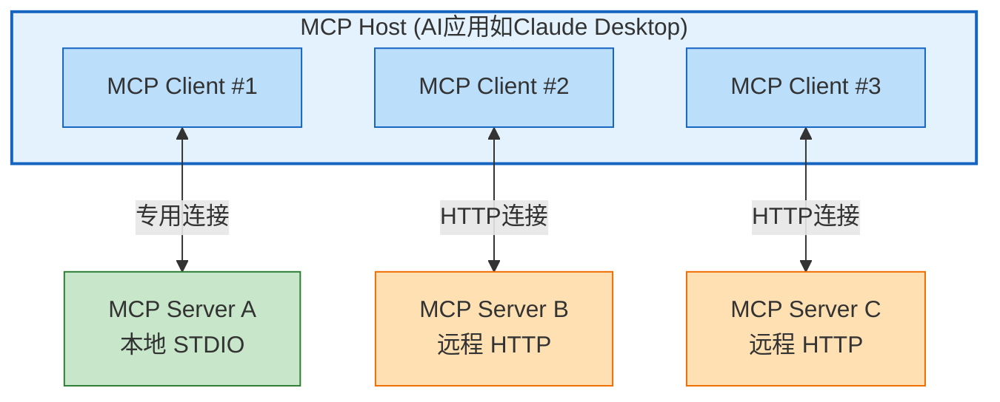
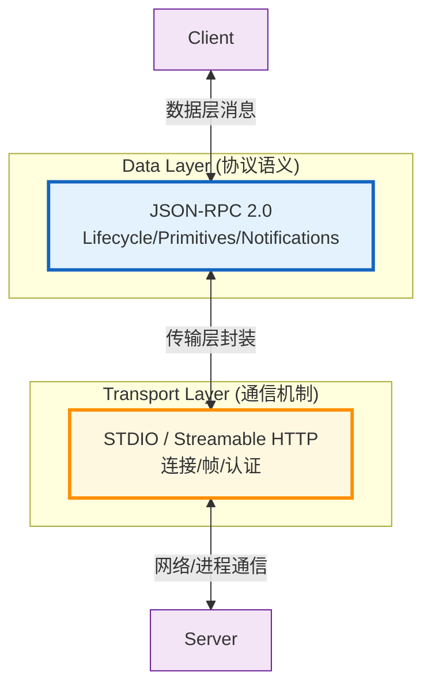
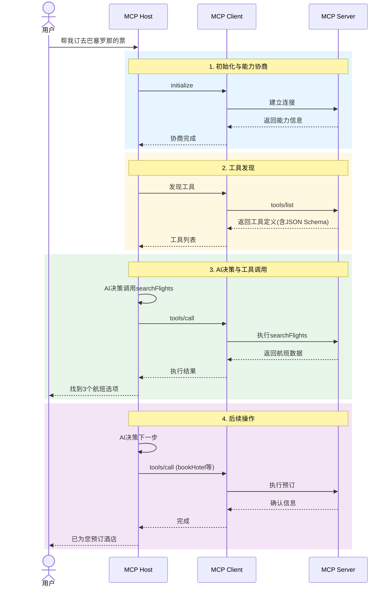
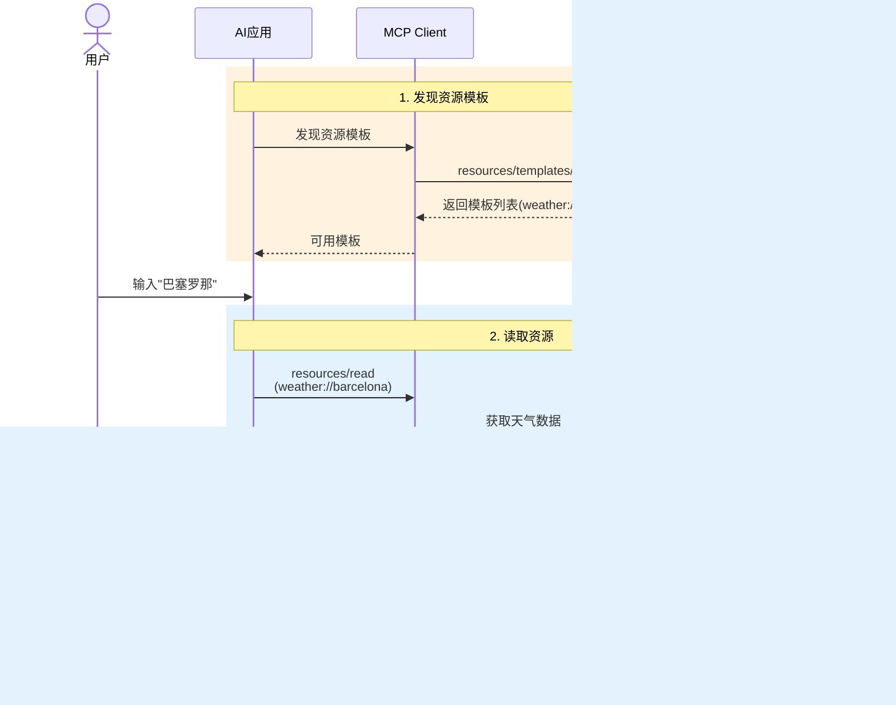
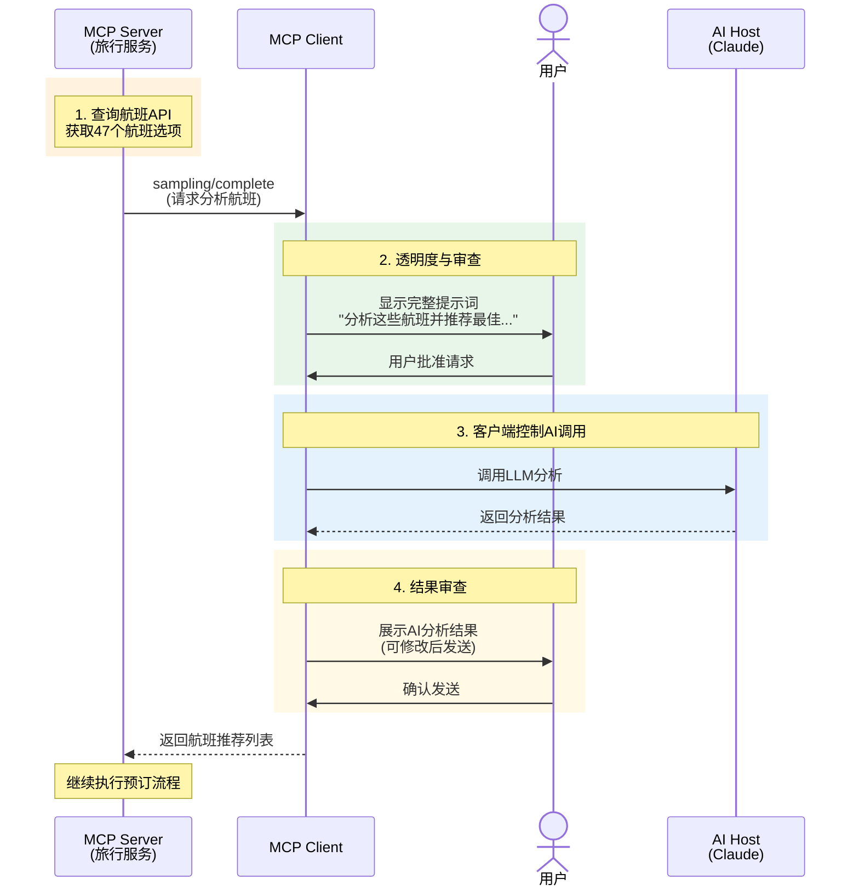
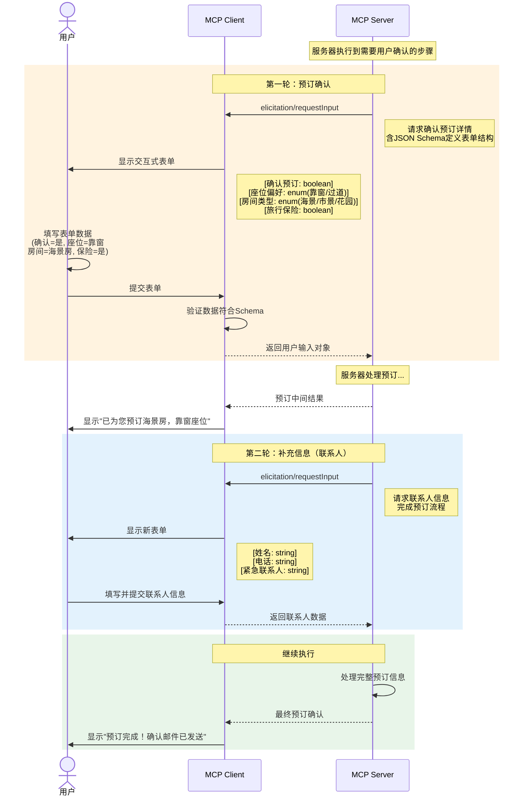
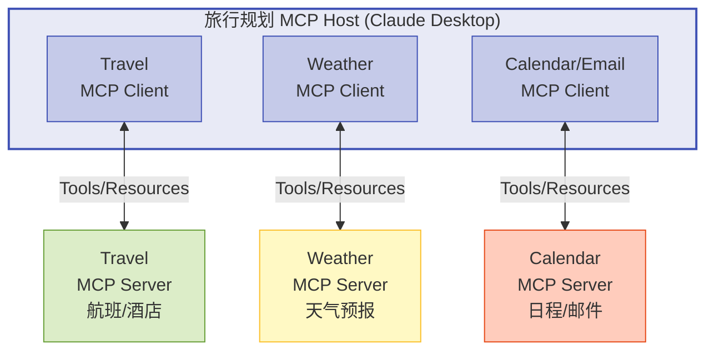
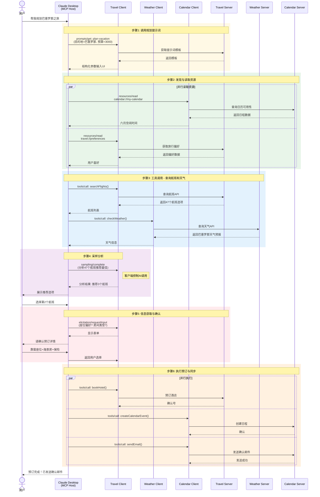

## 入门篇：什么是 MCP？

### MCP 的定义与价值

**Model Context Protocol (MCP)** 是一个开源标准协议，用于连接 AI 应用程序与外部系统。它就像 **USB-C 接口** 一样，为 AI 应用提供了一种标准化的方式来连接数据源、工具和工作流。

**MCP 能做什么？**

- 让 AI 助手访问你的 Google Calendar 和 Notion，成为个性化助理
- 让 Claude Code 根据 Figma 设计生成完整 Web 应用
- 让企业聊天机器人连接多个数据库，通过对话分析数据
- 让 AI 模型创建 3D 设计并通过 3D 打印机输出

### 为什么 MCP 很重要？

| 角色 | 收益 |
|------|------|
| **开发者** | 减少开发时间和复杂度，无需为每个集成重复造轮子 |
| **AI 应用** | 接入丰富的数据源和工具生态，增强能力 |
| **终端用户** | 获得更强大的 AI 应用，能访问个人数据并执行操作 |

<!-- more -->

## 架构篇：理解核心设计

### 架构参与者

MCP 采用 **客户端-服务器架构**，包含三个核心角色：




**关键概念：**

- **MCP Host**: 协调和管理多个 MCP 客户端的 AI 应用程序
- **MCP Client**: 与 MCP 服务器保持连接并获取上下文的组件（每个服务器对应一个客户端）
- **MCP Server**: 向 MCP 客户端提供上下文的程序（可本地或远程运行）

### 双层架构设计

MCP 由两个逻辑层组成：



### 传输层详解

**STDIO 传输**：

- 使用标准输入/输出流进行进程间通信
- 适用于本地 MCP 服务器（如文件系统服务器）
- 最佳性能，无网络开销
- 一对一连接（单服务器服务单客户端）

**Streamable HTTP 传输**：

- 使用 HTTP POST + Server-Sent Events (SSE)
- 适用于远程 MCP 服务器（如 Sentry 平台）
- 支持标准 HTTP 认证（Bearer Token、API Key）
- 推荐 OAuth 获取认证令牌
- 一对多连接（单服务器服务多客户端）


## 服务器篇：三大核心原语

MCP 服务器通过 **三大原语** 提供功能：

| 原语 | 控制权 | 用途 | 示例 |
|------|--------|------|------|
| **Tools** | 模型控制 | 可执行函数，AI 主动调用 | 搜索航班、发送邮件、创建日程 |
| **Resources** | 应用控制 | 只读数据源，提供上下文 | 文档内容、数据库 Schema、日历 |
| **Prompts** | 用户控制 | 结构化模板，指导工作流 | 规划假期、总结会议、起草邮件 |

### Tools（工具）

Tools 是让 AI 模型执行动作的**可执行函数**。

**协议操作：**

- `tools/list`: 发现可用工具（返回工具定义和 JSON Schema）
- `tools/call`: 执行特定工具

**生命周期时序图：**
                    



**示例 Tool 定义：**

```json
{
  "name": "searchFlights",
  "description": "搜索可用航班",
  "inputSchema": {
    "type": "object",
    "properties": {
      "origin": { "type": "string", "description": "出发城市" },
      "destination": { "type": "string", "description": "目的城市" },
      "date": { "type": "string", "format": "date" }
    },
    "required": ["origin", "destination", "date"]
  }
}
```

**信任与安全机制：**

- UI 显示可用工具，用户可控制是否启用
- 每次执行前可要求确认对话框
- 预授权安全操作（如只读查询）
- 完整的活动日志审计

### Resources（资源）

Resources 提供**结构化只读数据**，为 AI 提供上下文。

**两种发现模式：**

**直接资源**（固定 URI）：

- `calendar://events/2026` → 返回 2026 年日历
- `file:///path/to/doc.md` → 返回文档内容

**资源模板**（动态 URI）：

- `weather://forecast/{city}/{date}` → 任意城市天气
- `travel://activities/{city}/{category}` → 按类别筛选活动

**资源读取时序图：**



**资源订阅机制：**

- `resources/subscribe`: 订阅资源变更通知
- 服务器推送实时更新（如日历变动、文件修改）

### Prompts（提示词）

Prompts 是**用户控制的结构化模板**，用于标准化交互。

**与 Tools 的区别：**

- Tools 是模型自主决定的（Agentic 行为）
- Prompts 需要用户显式调用（如 `/plan-vacation`）

**示例 Prompt 定义：**

```json
{
  "name": "plan-vacation",
  "title": "规划假期",
  "description": "指导完成假期规划流程",
  "arguments": [
    { "name": "destination", "type": "string", "required": true },
    { "name": "duration", "type": "number", "description": "天数" },
    { "name": "budget", "type": "number" },
    { "name": "interests", "type": "array", "items": { "type": "string" } }
  ]
}
```

**典型 UI 模式：**

- `/` 斜杠命令（如 `/plan-vacation`）
- 命令面板搜索
- 上下文菜单推荐
- 专用 UI 按钮

## 客户端篇：增强交互能力

MCP 客户端不仅消费服务器提供的上下文，还能向服务器提供**三大核心功能**：

| 功能 | 说明 | 应用场景 |
|------|------|----------|
| **Sampling** | 服务器通过客户端请求 LLM 补全 | 旅行服务器分析 47 个航班选项，请求 AI 推荐最佳方案 |
| **Elicitation** | 服务器请求用户提供额外信息 | 预订确认时询问座位偏好、房间类型 |
| **Roots** | 客户端指定文件系统边界 | 限制服务器只能访问特定工作目录 |

### Sampling（采样）

允许服务器**通过客户端请求 LLM 能力**，实现"无模型依赖的 AI 服务"。

**完整交互流程：**



**设计优势：**

- 服务器无需集成 LLM SDK 或支付 API 费用
- 客户端完全控制权限和安全策略
- 支持 Human-in-the-loop（用户审查请求和响应）

### Elicitation（信息获取）

服务器可**动态请求用户输入**，避免前期收集所有信息。

**典型场景：预订确认流程**




**关键交互点说明：**

1. **Schema 驱动表单**：服务器通过 JSON Schema 定义表单字段类型（boolean、enum、string），客户端自动渲染对应 UI 控件（复选框、下拉框、文本框）

2. **验证环节**：客户端在返回数据前会验证用户输入是否符合 Schema，如果不符合会提示用户修正，减少服务器端验证负担

3. **多轮对话**：一个业务流程中可以包含多次 Elicitation 调用，按需分步收集信息（如先确认预订详情，再收集联系人信息）

4. **用户控制权**：用户可以选择拒绝提供信息或取消整个操作，客户端会处理这些异常流程并通知服务器

**隐私保护原则：**

- 绝不索要密码或 API Key
- 客户端警告可疑请求
- 用户可拒绝提供信息并取消操作

### Roots（根目录）

客户端指定**文件系统边界**，指导服务器工作范围。

**Roots 结构：**

```json
[
  { "uri": "file:///Users/agent/travel-planning", "name": "旅行规划工作区" },
  { "uri": "file:///Users/agent/travel-templates", "name": "模板库" },
  { "uri": "file:///Users/agent/client-documents", "name": "客户文档" }
]
```

**动态更新机制：**

- 用户打开新文件夹时自动添加 Root
- `roots/list_changed` 通知服务器更新边界
- 服务器"应该"尊重边界（协调机制，非强制安全边界）


## 实战篇：多服务器协作案例

### 场景：智能旅行规划助手

**系统架构：**



### 完整业务流程时序图
 


## 开发篇：工具链与最佳实践

### MCP 生态系统组件

| 组件 | 说明 |
|------|------|
| **MCP Specification** | 协议规范，定义客户端和服务器的实现要求 |
| **MCP SDKs** | 多语言 SDK（TypeScript、Python、Java、C# 等） |
| **MCP Inspector** | 开发和调试工具，用于测试服务器实现 |
| **Reference Servers** | 官方参考实现（文件系统、SQLite、Git 等） |

### 开发工作流

```
1. 设计阶段
   └── 确定服务器职责（工具/资源/提示词划分）
   
2. 实现阶段
   ├── 选择 SDK（TypeScript/Python）
   ├── 实现 Server Capabilities
   └── 定义 Primitives (Tools/Resources/Prompts)

3. 调试阶段
   ├── 使用 MCP Inspector 测试
   ├── 验证 JSON Schema 兼容性
   └── 测试生命周期管理

4. 部署阶段
   ├── 本地服务器（STDIO）：随客户端启动
   └── 远程服务器（HTTP）：独立部署，多租户支持
```

### 设计原则与最佳实践

**1. 单一职责原则**

- 每个服务器专注于特定领域（如：Travel Server 只处理旅行相关）

**2. 安全边界**

- Tools 执行前要求用户确认（尤其是写操作）
- Resources 保持只读，避免暴露敏感路径
- Prompts 透明展示模板内容，避免隐藏指令

**3. 渐进式发现**

- 支持动态列表（`*/list` 可实时变化）
- 利用 Notifications 通知客户端资源/工具更新
- 提供参数补全（如城市名自动建议）

**4. 错误处理**

- 使用 JSON-RPC 2.0 错误对象
- 长任务提供 Progress Token 和取消机制
- 采样请求处理超时和速率限制

### 快速开始示例（Python SDK）

```python
from mcp.server import Server
from mcp.types import Tool, TextContent

app = Server("travel-server")

@app.list_tools()
async def list_tools() -> list[Tool]:
    return [
        Tool(
            name="searchFlights",
            description="搜索可用航班",
            inputSchema={
                "type": "object",
                "properties": {
                    "origin": {"type": "string"},
                    "destination": {"type": "string"},
                    "date": {"type": "string", "format": "date"}
                },
                "required": ["origin", "destination", "date"]
            }
        )
    ]

@app.call_tool()
async def call_tool(name: str, arguments: dict):
    if name == "searchFlights":
        # 实现航班查询逻辑
        return [TextContent(type="text", text="航班列表...")]

# 启动 STDIO 传输
if __name__ == "__main__":
    app.run(transport="stdio")
```


## 总结

MCP 正在重新定义 AI 应用与外部世界的连接方式。通过标准化的协议层：

- **对开发者**：告别重复造轮子，一次开发处处集成
- **对 AI 应用**：无缝接入丰富的工具和数据生态
- **对用户**：获得真正个性化、能执行操作的 AI 助手

**关键记忆点：**

1. **三大原语**：Tools（模型控制）、Resources（应用控制）、Prompts（用户控制）
2. **双向能力**：服务器提供上下文，客户端提供采样/交互/根目录能力
3. **传输无关**：STDIO 用于本地，HTTP 用于远程，数据层完全一致
4. **人机协同**：所有敏感操作都可配置 Human-in-the-loop 审查

随着 Claude、VS Code、Cursor 等主流工具的支持，MCP 正成为 AI 集成的**事实标准**。现在正是加入 MCP 生态的最佳时机。


**参考资料：**

-  [MCP 官方介绍](https://modelcontextprotocol.io/docs/getting-started/intro)
-  [MCP 架构概览](https://modelcontextprotocol.io/docs/learn/architecture)
-  [MCP 服务器概念](https://modelcontextprotocol.io/docs/learn/server-concepts)
-  [MCP 客户端概念](https://modelcontextprotocol.io/docs/learn/client-concepts)