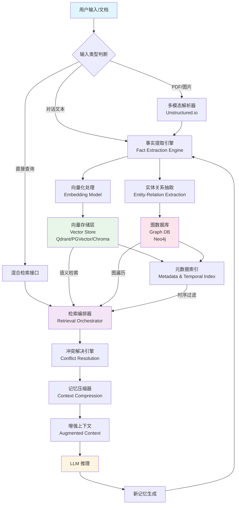
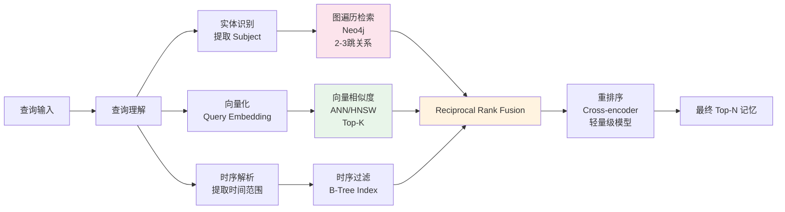
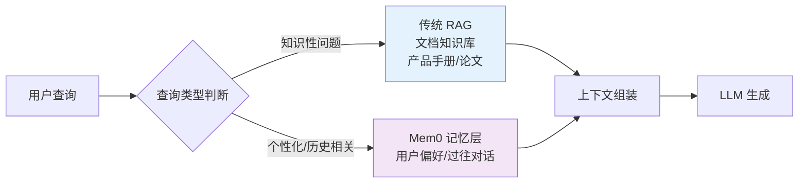

## Mem0 是什么？

**Mem0** (发音为"mem-zero") 是一个开源的 **AI 记忆层（Memory Layer）** 框架，专为大型语言模型（LLM）应用提供长期记忆能力。与简单的对话历史存储不同，Mem0 实现了语义理解、实体关系图谱、个性化偏好学习等高级记忆机制，使 AI 能够像人类一样"记住"用户、积累知识、并在多次会话中保持连续性。

其核心定位是介于传统 RAG（检索增强生成）与简单对话管理之间的**智能记忆中间件**，通过 **分层记忆架构（Tiered Memory Architecture）** 实现从短时记忆到长时记忆的完整生命周期管理。

<!-- more -->

## 系统架构设计

### 分层记忆架构



### 架构分层详解

**摄入层（Ingestion Layer）**

- **多模态解析**：支持文本、PDF（URL/Base64）、图片输入
- **智能分块**：基于语义的分块（Semantic Chunking）而非固定长度，保持上下文连贯性

**处理引擎层（Processing Layer）**

- **提取引擎（Extraction Engine）**：使用 LLM 从非结构化文本提取结构化三元组（Subject-Predicate-Object）
- **向量化引擎**：支持多种 Embedding 模型（本地 `nomic-embed-text` 或云端 `text-embedding-3-small`）
- **图构建引擎（Graph Builder）**：识别实体间关系，构建 Neo4j 属性图

**存储层（Storage Layer）**

- **向量存储**：HNSW 索引的近似最近邻（ANN）搜索，<50ms 延迟
- **图存储**：Neo4j 支持多跳关系推理（2-3 度关联）
- **元数据层**：时间戳、置信度、用户 ID、衰减分数、版本链

**检索与进化层（Retrieval & Evolution Layer）**

- **混合检索（Hybrid RAG）**：向量相似度 + 图遍历 + 时序过滤的融合排序（RRF 算法）
- **冲突解决**：时间感知的事实更新与版本控制
- **自适应遗忘**：基于艾宾浩斯遗忘曲线的衰减算法


## 核心实现原理深度解析

### 记忆表示模型：三元组与向量的双模态

Mem0 不采用简单的键值对存储，而是将记忆抽象为 **语义三元组** + **高维向量** 的双模态表示：

```python
# 内存中的记忆结构示例
MemoryObject = {
    "id": "uuid",
    "triplet": {
        "subject": "Alice",      # 主体
        "predicate": "prefers",  # 谓词/关系
        "object": "oat milk latte" # 客体
    },
    "vector": [0.23, -0.11, ...],  # 768-dim embedding
    "metadata": {
        "user_id": "alice",
        "confidence": 0.95,      # 提取置信度
        "created_at": "2026-03-25T10:00:00Z",
        "decay_score": 0.98,     # 当前相关性分数
        "source": "conversation_123",
        "supersedes": null       # 版本链指针
    }
}
```

**向量化策略**：

- 将三元组拼接为自然语言句子进行嵌入："Alice prefers oat milk latte"
- 使用 HNSW（Hierarchical Navigable Small World）图索引加速相似度搜索
- 支持 metadata payload 过滤（如 `user_id="alice" AND type="preference"`）

### 事实提取与结构化流水线

当接收到新输入时，Mem0 执行以下算法流程：

**步骤 1：实体识别与链接（NER & Entity Linking）**

- 使用轻量级 LLM（本地 3B/7B 模型）提取候选实体
- 与现有图数据库中的实体进行匹配（模糊匹配 + 向量相似度）
- 消歧处理：区分"Apple（公司）"与"Apple（水果）"基于上下文向量

**步骤 2：事实抽取提示工程**
```yaml
system_prompt: >
  从对话中提取原子化事实。规则：
  1. 使用第三人称客观描述（"用户提到..."）
  2. 每个事实必须独立完整，不依赖上下文
  3. 标注时间表达式（昨天→2026-03-24）
  4. 输出置信度 0.0-1.0
  
output_schema:
  facts:
    - subject: string
      predicate: string  
      object: string
      temporal_info: datetime | null
      confidence: float
      fact_type: "preference" | "personal_info" | "plan" | "relation"
```

**步骤 3：批量向量化与写入**

- 新事实批量计算 Embedding（批处理优化，利用 GPU 并行）
- 事务性写入：向量数据库 + 图数据库 + 关系型元数据表（PostgreSQL）保证一致性

### 冲突解决与版本控制

Mem0 实现了 **时间感知的事实更新算法**，核心逻辑如下：

**冲突检测触发条件**：

1. **实体-谓词匹配**：同一 `subject` + 相似 `predicate`（向量相似度 > 0.85）
2. **语义矛盾检测**：新旧事实的 `object` 向量余弦距离 > 0.5（表明语义相反）

**解决策略算法**：

```python
def resolve_conflict(new_fact, candidate_facts):
    for old in candidate_facts:
        # 时间优先策略
        if new_fact.timestamp > old.timestamp:
            if new_fact.confidence >= old.confidence * 0.8:
                # 软删除：保留旧版本，建立 supersession 链
                old.status = "superseded"
                old.superseded_by = new_fact.id
                new_fact.supersedes = old.id
                update_memory(new_fact)
            else:
                # 低置信度新事实，记录为待验证
                add_to_review_queue(new_fact)
        else:
            # 旧事实优先，但标记潜在矛盾
            if semantic_contradiction(new_fact, old):
                add_contradiction_tag(old.id, new_fact.id)
```

**版本链（Version Chain）**：

- 保留历史记忆用于审计和回溯查询（"你之前说喜欢拿铁，现在改美式了吗？"）
- 通过 `supersedes` 指针构建链表，支持查询"用户偏好演变历史"

### 自适应遗忘机制（Adaptive Decay）

模拟人类记忆的 **艾宾浩斯遗忘曲线**，Mem0 采用指数衰减公式：

$$
Relevance(t)=Importance_{initial}\times e^{-\lambda t}\times Recall\_boost
$$

上面公式参数说明：

- $Relevance(t)$：该条记忆在当前时间 $t$ 的相关度或活跃度
- $Importance_{initial}$：记忆的初始重要性权重，通常由系统根据上下文或用户反馈预先设定
- $e$：自然常数
- $\lambda$：遗忘速率（Decay Rate）, 偏好记忆 $\lambda=0.01$，事实记忆 $\lambda=0.05$
- $t$：自上次记忆被访问或创建以来的时间流逝值，单位天
- $Recall\_boost$：召回增强因子。当记忆被成功激活或再次调用（Rehearsal）时，该值会给予记忆额外的权重补偿，使其衰减得更慢

**分层存储策略**：

| 层级 | 时间范围 | 存储介质 | 检索策略 |
|------|----------|----------|----------|
| **热记忆** | 0-7 天 | 内存/Redis | 全量参与检索，权重 1.0x |
| **温记忆** | 7-30 天 | SSD 向量库 | 检索权重 0.7x，定期压缩摘要 |
| **冷记忆** | >30 天 | 对象存储(S3) | 仅高重要性保留索引，按需加载 |

**记忆压缩算法**：

- **实体级摘要**：将同一实体的多个事实合并为连贯段落（使用 LLM 摘要）
- **主题聚类**：对冷记忆使用 HDBSCAN 聚类，每类保留代表性样本
- **Token 预算管理**：根据当前 LLM 上下文窗口，动态选择 Top-K 记忆，确保总 Token < 400（相比原始 2000 Token 节省 80%）

### 混合检索算法（Hybrid Retrieval）

Mem0 的核心检索逻辑融合三种策略：



**RRF（Reciprocal Rank Fusion）公式**：

$$
\text{RRF}(doc) = \sum_{i=1}^{k} \frac{1}{r_i(doc) + \alpha}
$$

RRF（Reciprocal Rank Fusion）的中文名称为倒数排名融合，该公式为每个文档计算其在各排序列表中排名的倒数之和（加上常数 $\alpha$），最终按此得分从高到低重新排序，实现多源排序结果的融合。

其中：

- $doc$ 表示一个文档（或结果项）
- $k$ 是参与融合的排序列表总数
- $r_i(doc)$ 是文档 $doc$ 在第 $i$ 个排序列表中的排名（通常从1开始）
- $\alpha$ 是一个平滑常数（常用值为 $60$，也可根据场景调整，以避免排名靠后的项权重过小）


**检索示例**：

- **查询**："Alice 上周提到的项目用的什么技术栈？"
- **向量检索**：召回与"Alice"、"项目"、"技术栈"语义相关的记忆
- **图检索**：遍历 Alice → WORKS_ON → Project → USES_TECH → Technology 的路径
- **时序过滤**：仅保留 `created_at` 在上周范围内的结果


## 部署模式与资源架构

### 轻量级本地部署（Python SDK + Ollama）

适合个人开发者或隐私敏感场景，**完全离线运行**：

```python
from mem0 import Memory

# 配置本地 Ollama 作为 LLM 和 Embedding 后端
config = {
    "llm": {
        "provider": "ollama",
        "config": {
            "model": "llama3.1:8b",
            "ollama_base_url": "http://localhost:11434",
        }
    },
    "embedder": {
        "provider": "ollama",
        "config": {"model": "nomic-embed-text"}
    },
    "vector_store": {
        "provider": "qdrant",
        "config": {"path": "./qdrant_data"}  # 本地文件存储
    },
    "graph_store": {
        "provider": "neo4j",  # 可选，可禁用图记忆减少资源
        "enabled": False
    }
}

m = Memory.from_config(config)
```

**资源需求**：

- CPU：4核+
- RAM：16GB+（推荐 32GB 跑 7B-13B 模型）
- 存储：50GB+ SSD（模型文件 + 向量数据）
- GPU：可选，8GB+ VRAM 可显著加速推理

### 生产级 Docker 部署

完整技术栈包含三个核心容器：

```yaml
# docker-compose.yml 核心服务
services:
  mem0-api:
    image: mem0/mem0-api-server:latest
    environment:
      - VECTOR_STORE_PROVIDER=qdrant
      - GRAPH_STORE_PROVIDER=neo4j
      - LLM_PROVIDER=openai  # 或本地 vLLM
    ports:
      - "8000:8000"
  
  qdrant:
    image: qdrant/qdrant:latest
    volumes:
      - qdrant_storage:/qdrant/storage
  
  neo4j:
    image: neo4j:5-community
    environment:
      - NEO4J_AUTH=neo4j/password
      - NEO4J_PLUGINS=["apoc"]  # 图算法库
    volumes:
      - neo4j_data:/data
    # 关键：限制内存避免 OOM
    deploy:
      resources:
        limits:
          memory: 2G
```

**资源规划**：

- **最低**：2 vCPU + 4GB RAM（t3.medium 级别，无图记忆）
- **推荐**：4 vCPU + 8GB RAM（t3.large 级别，Neo4j 独立 2GB+）
- **大规模**：16GB+ RAM，向量库分片，Neo4j 集群模式

**性能基准**：

- 向量检索延迟：P95 < 50ms（百万级向量）
- 图遍历延迟：2 跳查询 < 100ms（Neo4j 内存充足时）
- 事实提取吞吐量：~50 facts/second（本地 7B 模型，GPU 加速）

### 官方托管服务（Mem0 Platform）

- **访问**：https://app.mem0.ai
- **架构**：Serverless 自动扩缩容，多租户隔离，SOC 2 Type II 合规
- **定价**：Free Tier（10K 记忆）→ Pro（按量计费）→ Enterprise（无限 + SLA）


## Mem0 与传统 RAG 的技术对比

| 技术维度 | 传统 RAG（如 LlamaIndex） | Mem0 记忆层 |
|----------|---------------------------|-------------|
| **数据结构** | 平铺文档块（Chunks） | 三元组知识 + 向量双模态 |
| **更新机制** | 批量重建索引（高延迟） | 实时增量更新 + 冲突解决 |
| **关系推理** | 仅语义相似度（无结构） | 显式图遍历（多跳推理） |
| **时序感知** | 无时间维度 | 遗忘曲线 + 时序索引 |
| **个性化** | 通用知识库 | 用户隔离 + 偏好学习 |
| **上下文管理** | 硬截断或简单 Top-K | 智能压缩 + 相关性重排序 |

**协同使用模式**：



生产级 AI Agent 的典型架构是 **RAG + Mem0 双轨制**：RAG 处理静态知识，Mem0 处理动态记忆。


## 开源生态与替代方案

Mem0 的架构设计影响了 AI 记忆层赛道，以下是主流开源替代方案：

### 顶级替代品技术对比

| 项目 | 核心架构差异 | 部署复杂度 | 适用场景 |
|------|-------------|-----------|----------|
| **Letta** (~21K Stars) | 代理自主管理记忆（Agent-controlled），支持记忆自我编辑 | 低（pip install） | 长期自治 Agent |
| **Zep + Graphiti** (~24K Stars) | 时序知识图谱（Temporal KG），事件追踪能力更强 | 中（Docker） | 时间敏感应用 |
| **Cognee** (~12K Stars) | 数据→图转换管道更完善，支持复杂 ETL | 低 | 机构知识库 |
| **Hindsight** | 多策略混合检索（Graph + Temporal + BM25），准确率优化 | 低 | 高准确率生产环境 |
| **OpenMemory** | SQLite 本地优先，无向量依赖（关键词+语义混合） | 极低 | 完全离线隐私场景 |

**选型建议**：

- **全功能替代**：Letta 或 Zep（社区活跃，功能对标 Mem0）
- **超轻量本地**：OpenMemory（SQLite 单文件，无 Docker 依赖）
- **时序强需求**：Zep 的时序图谱能力
- **LangChain 生态**：LangMem（无缝集成，功能较基础）


## 应用场景与最佳实践

### 个性化 AI 伴侣

- **实现**：长期积累用户饮食偏好、生活习惯、社交关系
- **技术点**：利用图记忆构建"人际关系网"，识别"Alice 的朋友 Bob 喜欢咖啡"这类间接知识

### 企业级客户服务 Agent

- **实现**：跨会话保持客户背景（历史订单、投诉记录）
- **技术点**：用户 ID 隔离 + 冲突解决（客户地址变更历史追踪）

### 研究助手与知识管理

- **实现**：PDF 论文摄入 → 提取关键发现 → 构建研究知识图谱
- **技术点**：多模态文档解析 + 实体链接（将论文中的方法名链接到已有知识）

### 多 Agent 协作系统

- **实现**：Mem0 作为共享记忆总线，多个 Agent 读写共同的用户画像
- **技术点**：细粒度权限控制（某些记忆仅特定 Agent 可访问）


## 总结

Mem0 的技术价值在于将 AI 应用从**无状态的单轮对话**提升为**有状态的持续学习系统**。其架构亮点包括：

1. **双模态存储**：向量语义检索 + 图关系推理的有机结合
2. **记忆进化**：冲突解决、版本控制、自适应遗忘构成的闭环
3. **工程化成熟**：从本地轻量部署到企业级分布式架构的完整支持

随着 AI Agent 向个性化、长期化方向发展，Mem0 所代表的**认知记忆层（Cognitive Memory Layer）** 将成为新一代 AI 架构的基础设施。

**参考资源**：

- GitHub：https://github.com/mem0ai/mem0
- 官方文档：https://docs.mem0.ai/open-source/overview
- 部署指南：https://mem0.ai/blog/self-host-mem0-docker