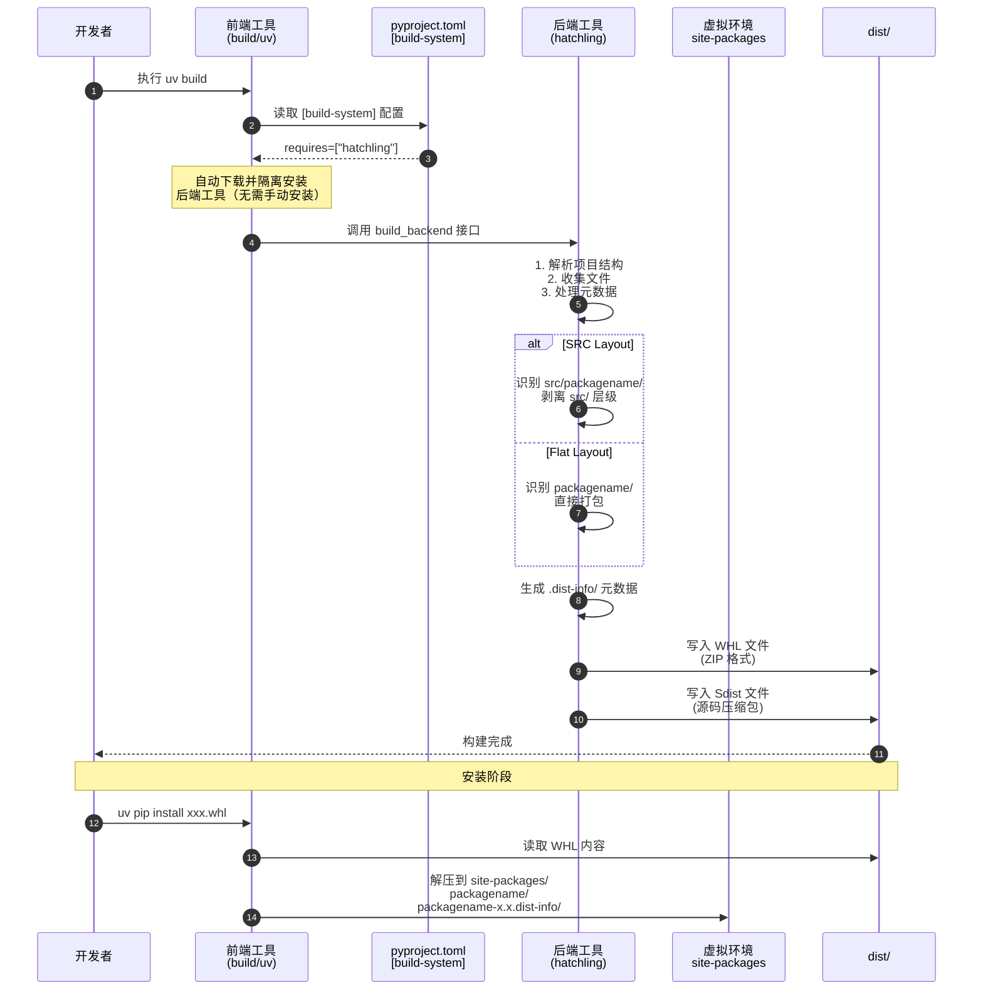

当你完成一个 Python 项目，想要发布到 PyPI 供全球开发者下载时，你是否遇到过这些困惑：

- `pip install` 背后到底发生了什么？
- 为什么安装 `beautifulsoup4` 却要 `import bs4`？
- 项目代码应该放在根目录还是 `src` 目录？
- `python -m build` 和 `uv build` 有什么区别？

本文将从**依赖安装的底层机制**出发，逐步深入到 **WHL 文件构建流程**，最后探讨**现代化项目结构**的最佳实践。无论你是刚接触 Python 打包的新手，还是希望迁移到现代工具链的开发者，这篇文章都能给你清晰的指引。

## 依赖安装机制：当你执行 `pip install` 时发生了什么？

### 软件包从哪来？——PyPI 与 WHL 文件

当你执行 `pip install flask` 时，工具背后做了三件核心的事：

1. **查询元数据**：向 [PyPI](https://pypi.org/)（Python Package Index，Python 官方的软件包仓库）请求 `flask` 的包信息
2. **下载 WHL 文件**：根据你的 Python 版本和操作系统，选择最合适的 `.whl` 文件下载
3. **解压安装**：将 WHL 文件解压到当前 Python 环境的 `site-packages` 目录

**WHL（Wheel）** 是 Python 的二进制分发格式标准（由 [PEP 427](https://peps.python.org/pep-0427/) 定义）。它本质上就是一个 **ZIP 压缩包**，里面包含了：

- 预编译的代码（或纯 Python 源代码）
- 包的元数据（依赖关系、版本信息等）

让我们以 `Flask 3.1.1` 为例，看看 WHL 文件的真面目：

```bash
# 下载 Flask 的 WHL 文件（不安装）
pip download flask==3.1.1 -d ./downloads

# 查看 WHL 内容（WHL 就是 ZIP）
unzip -l ./downloads/flask-3.1.1-py3-none-any.whl
```

<!-- more -->

### WHL 文件内部结构解析

解压一个典型的 WHL 文件，你会看到两类核心内容：

```
flask-3.1.1-py3-none-any.whl
├── flask/                    # ← 代码目录（包的实际代码）
│   ├── __init__.py
│   ├── app.py
│   ├── helpers.py
│   └── ...
├── flask-3.1.1.dist-info/    # ← 元数据目录
│   ├── METADATA              # 包信息、依赖列表
│   ├── RECORD                # 文件清单和哈希值
│   ├── WHEEL                 # Wheel 格式版本信息
│   └── top_level.txt         # 顶级包名列表
└── ...
```

核心目录说明：

| 目录 | 作用 | 重要性 |
|------|------|--------|
| `flask/` | 存放所有可导入的 Python 代码 | 执行 `import flask.app` 时，Python 就是在这里找 `app.py` |
| `.dist-info/` | 包含包的元数据 | `METADATA` 文件记录了该包依赖哪些其他库，`pip` 据此自动安装依赖 |

**注意**：代码目录名不一定等于安装时的包名。例如：

- 安装：`pip install beautifulsoup4`
- 导入：`import bs4`

这是因为 `beautifulsoup4` 的 WHL 文件中，代码目录被命名为 `bs4` 而非 `beautifulsoup4`。

### 安装的本质：解压缩到 site-packages

当你执行 `pip install flask` 时，实际发生的是：

```bash
1. 下载 flask-3.1.1-py3-none-any.whl
2. 解压到：/path/to/python/site-packages/
   ├── site-packages/
   │   ├── flask/              # 代码目录
   │   ├── flask-3.1.1.dist-info/  # 元数据
   │   └── ...
3. 读取 METADATA，递归安装依赖（Werkzeug, Jinja2 等）
```

## WHL 文件构建流程：如何把你的代码变成可分发的包？

理解了 WHL 是什么，下一步是：**如何将自己的项目打包成 WHL 文件？**

### 构建系统的核心概念：前端与后端

Python 的打包体系在 [PEP 517](https://peps.python.org/pep-0517/) 之后被解耦为两个角色：**构建前端（Build Frontend）** 和 **构建后端（Build Backend）**。这种解耦设计是 Python 打包生态现代化的关键一步，它打破了过去 setuptools 一家独大的局面，让开发者能够灵活选择工具组合。

**Python Packaging Authority (PyPA)** 是维护 Python 打包生态的权威组织，负责 `pip`、`venv`、`twine`、`build` 等核心工具。[build](https://pypa-build.readthedocs.io/) 是 PyPA 官方维护，最纯粹的前端，零配置，兼容性最好的构造前端。

2026 年最主流的后端推荐（从快到社区接受度排序）：

- hatchling（目前最推荐之一，干净、插件化好）
- PDM backend
- poetry-core（Poetry 用户常用）
- flit-core（极简项目）
- setuptools（新项目不推荐）

> 为什么推荐 `hatchling` 而非传统的 `setuptools`？`setuptools` 历史悠久，但为了向后兼容积累了大量复杂配置，而 `hatchling` 作为新一代工具，默认行为更合理，且对现代项目结构（如 `src` 布局）支持更好。

除了纯粹的构建前端和构建后端外，还有不少全功能管理工具：

- [uv](https://docs.astral.sh/uv/)：Rust 编写，极速，前后端一体化但内部解耦。现代工作流首选，追求极致速度，可以配置其他构造后端。
- [Poetry](https://python-poetry.org/)：依赖管理 + 构建 + 发布一体化，锁定文件精确。适合需要精确控制依赖树的场景。
- [PDM](https://pdm-project.org/)：PEP 582 支持，现代 Python 管理，配置灵活。适合喜欢灵活配置的开发者。
- [Hatch](https://hatch.pypa.io/)：官方 PyPA 项目，环境管理 + 构建 + 版本管理。

整个 Python 打包流程：



### 项目配置：pyproject.toml

`pyproject.toml` 是现代 Python 项目的**唯一配置文件**（替代了曾经的 `setup.py`、`setup.cfg`、`requirements.txt` 等多文件配置）。

指定构建系统的[最小配置](https://hatch.pypa.io/latest/config/build/#build-system) ：

```toml
[build-system]
requires = ["hatchling"]
build-backend = "hatchling.build"
```


完整示例（包含项目元数据）：

```toml
[build-system]
requires = ["hatchling"]
build-backend = "hatchling.build"

[project]
name = "webrtc-vad-py"
version = "0.1.0"
description = "Python bindings for WebRTC VAD"
readme = "README.md"
license = {file = "LICENSE"}
requires-python = ">=3.8"
dependencies = [
    "numpy>=1.20",
]

[project.optional-dependencies]
dev = [
    "pytest>=7.0",
    "black",
]
```

### 执行打包

安装前端工具（仅需一次）：

```bash
pip install build
# 或使用 uv（更快）
# uv pip install build
```

执行打包：

```bash
# 标准方式
python -m build

# 使用 uv（推荐，速度更快）
uv build
```

**`build` 工具的聪明之处**：它会自动读取 `pyproject.toml` 中的 `[build-system]`，下载指定的后端（如 `hatchling`），然后用它来打包。**你无需手动安装 `hatchling`**。

打包完成后，检查生成的文件：

```bash
ls dist/
# webrtc_vad_py-0.1.0-py3-none-any.whl   ← 二进制分发包（WHL）
# webrtc_vad_py-0.1.0.tar.gz             ← 源码分发包（Sdist）

# 查看 WHL 内部结构
unzip -l dist/webrtc_vad_py-0.1.0-py3-none-any.whl
```

### 安装自己打包的 WHL

```bash
# 标准 pip 安装
pip install dist/webrtc_vad_py-0.1.0-py3-none-any.whl

# 如果在 uv 环境中，使用 uv pip
uv pip install dist/webrtc_vad_py-0.1.0-py3-none-any.whl
```

### Hatchling 的进阶配置

当项目结构不符合 Hatchling 默认预期时（例如代码文件散落在根目录），需要显式配置打包范围：

```toml
[tool.hatchling]
packages = ["foo.py", "utils/"]  # 明确指定要打包的文件或目录
```

这告诉 Hatchling：**只把 `foo.py` 和 `utils/` 目录打包到 WHL 的根目录**，其他文件（如测试、文档）不会进入分发包。


## 现代化 Python 项目结构：Flat vs SRC 布局

项目结构不仅关乎美观，更直接影响**打包行为**、**导入方式**和**开发体验**。社区目前主要有两种布局方式。

### Flat Layout（扁平布局）

**结构示意**：

```
my-project/
├── myproject/          # ← 代码目录（与项目名同名）
│   ├── __init__.py
│   ├── core.py
│   └── helpers.py
├── tests/              # 测试文件
├── docs/               # 文档
├── pyproject.toml
└── README.md
```

**特点**：

- 安装后，代码位于 `site-packages/myproject/`
- 导入时使用 `import myproject.core`，避免命名冲突
- 缺点：当项目复杂时，根目录下混杂着代码、测试、配置，**难以直观区分哪些文件会被打包**

### SRC Layout（源目录布局）

**结构示意**：

```
my-project/
├── src/                # ← 所有待打包代码放在这里
│   └── myproject/      # 代码目录
│       ├── __init__.py # 空文件，标记这是可导入的包
│       ├── core.py
│       └── helpers.py
├── tests/              # 与 src 同级，不会被意外打包
├── scripts/            # 开发脚本
├── docs/               # 文档
├── pyproject.toml
└── README.md
```

**核心优势**：

1. **职责分离清晰**：一眼就能看出 `src/` 是产品代码，`tests/` 是测试代码，互不干扰
2. **Hatchling 默认支持**：无需额外配置 `packages`，开箱即用
3. **防止意外打包**：避免把测试文件、本地配置打包进 WHL

**关于 `__init__.py`**：

在 `src/myproject/` 中放置一个空的 `__init__.py` 文件，是告诉 Python：**这是一个可导入的包目录**（Python 3.3+ 的隐式命名空间包虽然允许省略，但显式声明仍是最佳实践）。

**打包后的效果**：
WHL 文件中，`src/` 这层目录会被"剥离"，内容直接放在根目录。用户安装后依然使用 `import myproject.core`，**无需也不应该**写成 `import src.myproject.core`。

### 布局对比总结

| 特性 | Flat Layout | SRC Layout |
|------|-------------|------------|
| 结构清晰度 | 简单项目够用，复杂项目易混乱 | 始终清晰分离产品代码与辅助文件 |
| Hatchling 配置 | 可能需要显式配置 `packages` |  通常零配置即可工作 |
| 开发时导入 | 直接运行可能遇到路径问题 | 配合开发模式安装，体验一致 |
| 社区趋势 | 传统项目常见 | 现代项目首选 |


## 开发阶段的关键：Editable Mode（开发模式安装）

在 SRC 布局中，如果你直接运行：

```bash
python src/myproject/core.py
```

代码中使用了绝对导入 `import myproject.helpers`，Python 会报错：`ModuleNotFoundError: No module named 'myproject'`。

**原因分析**：

Python 的模块查找路径（`sys.path`）包含当前脚本目录。当直接运行 `src/myproject/core.py` 时，Python 会在 `src/myproject/` 下寻找 `myproject` 子目录，这显然找不到。

**解决方案**：Editable Mode（`-e` 安装）

将项目以**编辑模式**安装到当前虚拟环境：

```bash
pip install -e .
# 或 uv 环境
uv pip install -e .
```

**`-e`（editable）的神奇之处**：

- 普通安装：`pip install .` 会把代码**复制**到 `site-packages/`，修改源代码后需要重新安装才能生效
- 编辑模式：`pip install -e .` 会在 `site-packages/` 创建一个**指向你本地源代码的链接**（或 `.pth` 路径文件）

这意味着：

1. **实时同步**：你修改代码，"安装"的版本立即生效，无需重新打包安装
2. **路径正确**：项目根目录被加入 `sys.path`，`import myproject.helpers` 能正确解析
3. **开发体验一致**：内部导入方式与外部用户使用方式完全相同（都用绝对导入）

我们可以使用 `uv` ，它直接支持 editable 模式，体验更丝滑：

```bash
# uv run 会自动处理项目的 editable 安装
uv run python src/myproject/core.py
# 或
uv run pytest
```

无需手动执行 `pip install -e .`，工具会在后台搞定一切。


## 总结与最佳实践清单

### 核心知识点回顾

1. **WHL 本质**：ZIP 压缩包，包含代码目录和元数据目录，安装即解压到 `site-packages`
2. **导入路径**：由代码目录名决定，可能与安装包名不同（如 `beautifulsoup4` → `bs4`）
3. **构建系统**：前端（如 `build`）调用后端（如 `hatchling`），通过 `pyproject.toml` 配置
4. **项目布局**：优先使用 SRC Layout（`src/packagename/`），结构清晰且现代工具支持好
5. **开发模式**：使用 `pip install -e .` 或 `uv run` 解决开发阶段的导入问题

### 新项目启动清单

```bash
# 1. 创建 SRC 布局结构
mkdir my-project && cd my-project
mkdir -p src/myproject tests docs

# 2. 初始化包标记
touch src/myproject/__init__.py

# 3. 创建 pyproject.toml（使用 hatchling）
cat > pyproject.toml << 'EOF'
[build-system]
requires = ["hatchling"]
build-backend = "hatchling.build"

[project]
name = "myproject"
version = "0.1.0"
description = "My awesome project"
readme = "README.md"
requires-python = ">=3.9"
dependencies = []
EOF

# 4. 开发模式安装（使用 uv）
uv pip install -e .

# 5. 编码、测试、迭代...

# 6. 打包分发
uv build
# 产物在 dist/ 目录：.whl 和 .tar.gz
```

### 工具选择建议

| 场景 | 推荐工具 | 命令 |
|------|---------|------|
| 构建打包 | `uv build` 或 `python -m build` | `uv build` |
| 依赖管理 | `uv pip` 或 `pip` | `uv pip install -e .` |
| 发布到 PyPI | `twine` 或 `uv publish` | `twine upload dist/*` |
| 环境管理 | `uv venv` 或 `python -m venv` | `uv venv` |