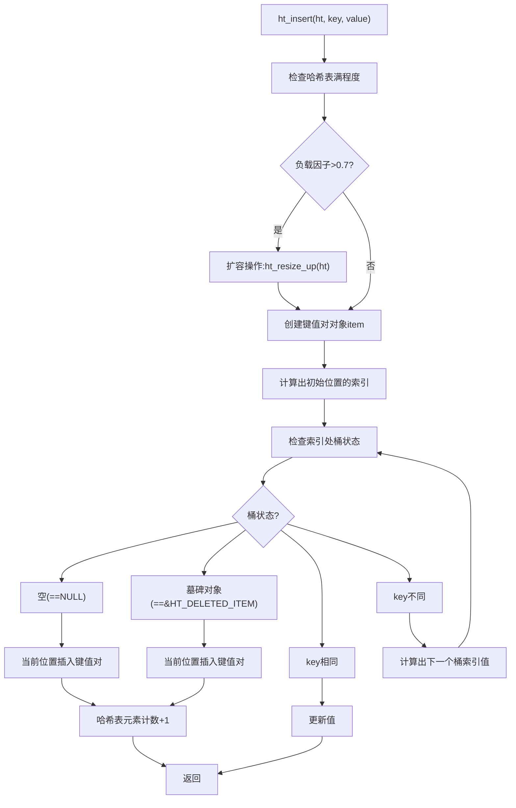
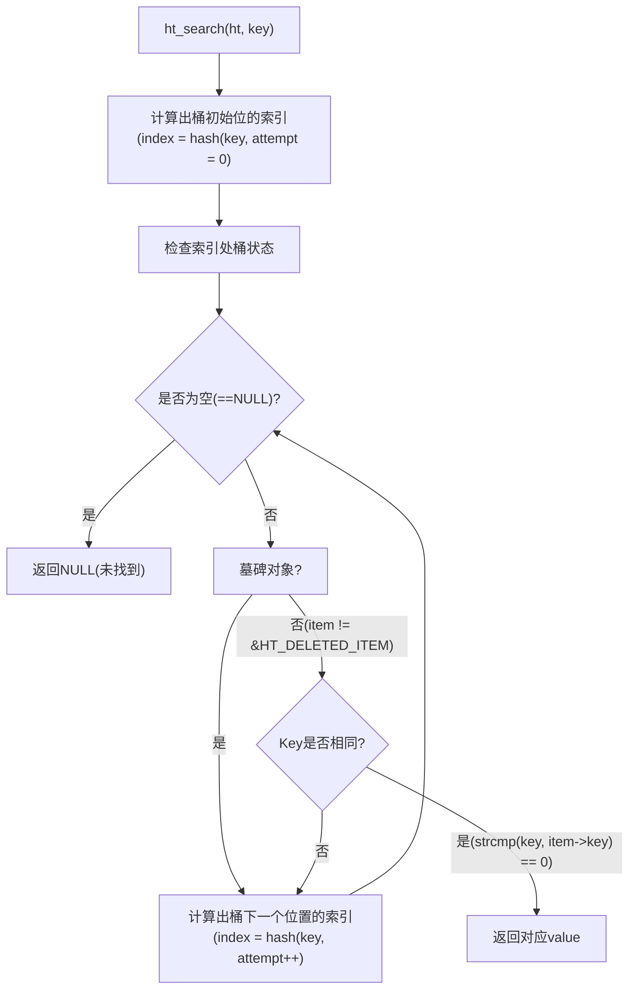
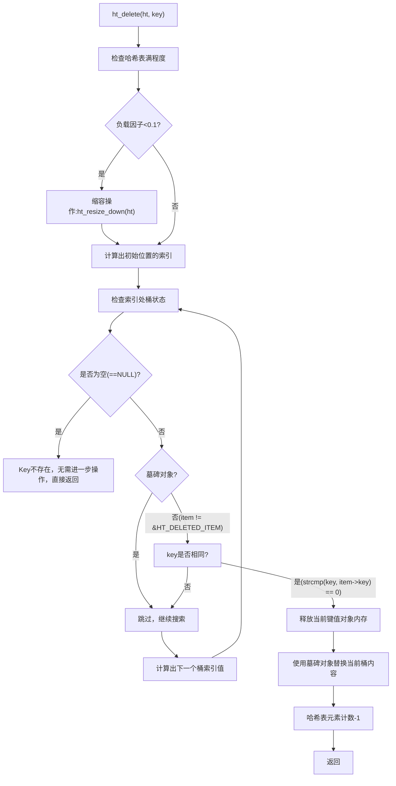

title: 从零开始写一个哈希表
author: Tink
tags:
  - 哈希表
  - hash table
  - 映射
  - 字典
categories:
  - 数据结构与算法
date: 2025-06-22 12:00:00
---

这篇笔记是对教程：[write a hash table](https://github.com/jamesroutley/write-a-hash-table) 的学习总结。该教程使用C语言，从零开始实现了一个哈希表，教程中哈希表实现使用了[开放地址法](https://en.wikipedia.org/wiki/Open_addressing)，[双重哈希](https://en.wikipedia.org/wiki/Double_hashing)等技术。本篇笔记中部分内容对原教程进行了拓展。

## 什么是哈希表？

[哈希表（Hash Table）](https://en.wikipedia.org/wiki/Hash_table)是一种基于键值对（Key-Value）存储的高效数据结构，通过哈希函数（Hash Function）将键（Key）映射到数组的特定位置（桶），从而实现平均 O(1) 时间复杂度的插入、查找和删除操作。

下面是基于哈希表存储电话簿的结构图：


<!--more-->

## 开放地址法

哈希表实现方式有 **[链地址法(Separate Chaining)](https://en.wikipedia.org/wiki/Hash_table#Separate_chaining)** 和 **[开放地址法(Open Addressing)](https://en.wikipedia.org/wiki/Open_addressing)**，教程中使用的是开放地址法。

链地址法实现的结构示意图：


开发地址法实现的结构示意图：


开放地址法也称开放寻址法，它的工作原理是当发生哈希冲突时，按照**预定的探测序列**在哈希表中寻找下一个可用桶，直到满足以下条件之一。开放地址法具有下面优缺点：

| 优点             | 缺点             |
| -------------- | -------------- |
| 内存局部性好（无链表指针）  | 易发生聚集（Cluster） |
| 适合小数据量或内存受限场景  | 删除操作复杂（需标记墓碑）  |
| 缓存命中率高（连续内存访问） | 负载因子过高时性能急剧下降  |

开放地址法发生冲突时候，常见的探查方法包括：

- **线性探查（Linear Probing）**：当发生冲突时，依次检查后续的槽位，直到找到一个空槽。
	
- **二次探查（Quadratic Probing）**：当发生冲突时，按照二次函数的步长进行探查。
    
- **双重哈希（Double Hashing）**：当发生冲突时，使用第二个哈希函数来确定探查的步长。

## 哈希函数

教程中实现哈希函数采用的是 **多项式哈希（Polynomial Hashing）**。多项式哈希中每个字符的 ASCII 码按幂次加权累加，类似多项式求值。

```c
function hash(string, a, num_buckets):
    hash = 0
    string_len = length(string)
    for i = 0, 1, ..., string_len:
        hash += (a ** (string_len - (i+1))) * char_code(string[i])
    hash = hash % num_buckets
    return hash
```

上面伪代码会输出一个介于 0 到 num_buckets-1 之间的整数，函数中各个参数说明如下：

- string：要哈希的字符串。
- a：一个大于字母表大小的质数。
- num_buckets：哈希表的桶数量（m）。

### 多项式哈希的数学表达

多项式哈希的数学表达式如下：

$$
\text{hash}(s, a, m) = \left( \sum_{i=0}^{n-1} a^{n-1-i} \cdot \text{char\_code}(s[i]) \right) \bmod
$$

- s: 输入字符串。
- n: 字符串长度。
- char_code(s[i]): 字符串第 i 个字符的 ASCII 码。
- a: 质数（大于字母表大小，例如 151）。
- m: 哈希表桶数量。

我们以教程中的例子 `hash("cat", 151, 53)` 验证公式：

对于字符串 `s = "cat"`，长度 $n = 3$。每个字符 ASCII 码如下：

- $s[0] = 'c' = 99$
- $s[1] = 'a' = 97$
- $s[2] = 't' = 116$

其中参数：$a = 151$，$m = 53$。

公式：

$$
\text{hash} = \left( a^{n-1} \cdot s_0 + a^{n-2} \cdot s_1 + a^{n-3} \cdot s_2 \right) \bmod m
$$

代入：

$$
\text{hash} = \left( 151^{2} \cdot 99 + 151^{1} \cdot 97 + 151^{0} \cdot 116 \right) \bmod 53
$$

计算过程如下：

- $151^2 = 22801$，$22801 \cdot 99 = 2257299$
- $151^1 = 151$，$151 \cdot 97 = 14647$
- $151^0 = 1$，$1 \cdot 116 = 116$
- 总和：$2257299 + 14647 + 116 = 2272062$
- 取模：$2272062 \mod 53 = 5$

最总结果：$\text{hash} = 5$，与教程一致。

最终的哈希函数实现如下：

```c
static int ht_hash(const char *s, const int a, const int m) {
  long hash = 0;
  const int len_s = strlen(s);
  for (int i = 0; i < len_s; i++) {
    hash += (long)pow(a, len_s - (i + 1)) * s[i];
  }

  hash = hash % m;
  return (int)hash;
}
```

## 双重哈希

[双重哈希（Double Hashing）](https://en.wikipedia.org/wiki/Double_hashing)是开放地址法解决哈希冲突的一种方法。开放地址法的核心思想是当发生哈希冲突时，使用某种探查序列在哈希表中寻找下一个可用的槽位来存储元素。

在双重哈希中，探查序列是通过两个不同的哈希函数组合来确定的。第一个哈希函数`h₁(k)`用于计算初始的哈希地址，当发生冲突时，第二个哈希函数`h₂(k)`用来确定探查的步长间隔，从而构造出一个新的哈希地址序列。**第二个哈希函数`h₂(k)`必须与 哈希桶数量m 互质（即最大公约数为1）**。这也就是为什么教程中哈希桶数量m总是设置为了素数，因为若 m 为素数，只需保证 `h₂(k) < m` 且 `h₂(k) ≠ 0`，即可自动满足互质条件。

第二个函数的要求可以见维基百科关于双重哈希的[选择h₂(k)](https://en.wikipedia.org/wiki/Double_hashing#Selection_of_h2(k))部分。

双重哈希伪代码实现：

```shell
index = hash_a(string) + i * hash_b(string) % num_buckets
```

**第二个哈希函数`h₂(k)`必须与 哈希桶数量m 互质（即最大公约数为1）** 这个是利用了素数的一个特性（它属于数论中的完全剩余系（Complete Residue System））：

> 如果两个整数 $a$ 和 $b$ 互质，那么对于 $i = 0, 1, 2, \ldots, b-1$，表达式 $(a \times i) \mod b$ 的结果将恰好是集合 $\{0, 1, 2, \ldots, b-1\}$ 的一个排列。这意味着每个整数从$0$到 $b-1$ 都会恰好出现一次。

假设 $a = 3$，$b = 7$，因为 $\gcd(3, 7) = 1$，我们计算：

$$
3 \cdot i \mod 7 \text{ for } i = 0 \ldots 6
$$

| i | 3 × i | (3×i) mod 7 |
| - | ----- | ----------- |
| 0 | 0     | 0           |
| 1 | 3     | 3           |
| 2 | 6     | 6           |
| 3 | 9     | 2           |
| 4 | 12    | 5           |
| 5 | 15    | 1           |
| 6 | 18    | 4           |

结果是：`{0, 1, 2, 3, 4, 5, 6}` —— 恰好是模 7 下的所有余数，且无重复。

教程中为了避免当hash_b为0时候导致的死循环，实际处理时候会将hash_b值加1：

```c
index = (hash_a(string) + i * (hash_b(string) + 1)) % num_buckets
```

对应的C代码如下：

```c
// hash_table.c
static int ht_get_hash(
    const char* s, const int num_buckets, const int attempt
) {
    const int hash_a = ht_hash(s, HT_PRIME_1, num_buckets);
    const int hash_b = ht_hash(s, HT_PRIME_2, num_buckets);
    return (hash_a + (attempt * (hash_b + 1))) % num_buckets;
}
```

但是存在漏洞，当`hash_b % num_buckets == 0`时候依旧会死循环。解决办法如下：

```c
static int ht_get_hash(const char *s, const int num_buckets,
                       const int attempt) {
  const int hash_a = ht_hash(s, HT_PRIME_1, num_buckets);
  int hash_b = ht_hash(s, HT_PRIME_2, num_buckets);
  if (hash_b % num_buckets == 0) hash_b = 1;
  return (hash_a + attempt * hash_b) % num_buckets;
}
```

上面代码中`if (hash_b % num_buckets == 0) hash_b = 1`，既解决了`hash_b == 0`时候造成的死循环，也解决了`hash_b % num_buckets == 0`时候造成的死循环。

为什么`hash_b == 0`或`hash_b % num_buckets == 0`会造成死循环，可以通过下面的两个模运算公式推导得出：

 **加法模运算**

$$
(a + b) \mod m = ((a \mod m) + (b \mod m)) \mod m
$$

**乘法模运算**

$$
(a \cdot b) \mod m = ((a \mod m) \cdot (b \mod m)) \mod m
$$

## 获取素数

当哈希表进行扩容和缩容时候，需要重建哈希表，它涉及到确定新哈希表桶的数量。由于碰撞时候采用的是双重哈希方法，它要求哈希表中桶的数量必须是素数，那么在确定哈希表桶数量的时候需要判断一个整数是否是素数。教程中判断一个整数是否是素数采用的是 **试除法（Trial Division）**。

试除法基本思想是：如果一个数 $n$ 不是素数，那么它必定存在一个小于或等于其平方根的因数。以下是具体步骤：
- 对于给定的数 $n$，从2开始，检查它是否能被小于或等于 $\sqrt{n}$ 的整数整除。
- 如果能找到一个这样的因数，那么 $n$ 不是素数。
- 如果没有找到这样的因数，那么 $n$ 是素数。

试除法的时间复杂度为 $O(\sqrt{n})$ ，效率较低。
```c
/*
 * Return whether x is prime or not
 *
 * Returns:
 *   1  - prime
 *   0  - not prime
 *   -1 - undefined (i.e. x < 2)
 */

int is_prime(const int x) {
  if (x < 2) return -1;
  if (x < 4) return 1;
  if (x % 2 == 0) return 0;

  int sqrt_x = (int)sqrt(
      (double)x);  // 相比原代码，移到for循环外面后，只需 计算 sqrt 一次
  for (int i = 3; i <= sqrt_x;
       i += 2) {  // i <= sqrt_x 也可以改成 i * i < x 性能更佳
    if (x % i == 0) return 0;
  }
  return 1;
}

/*
 * Return the next prime after x, or x if x is prime
 */
int next_prime(int x) {
  while (is_prime(x) != 1) {
    x++;
  }
  return x;
}
```

## 扩容与缩容

**负载因子（Load Factor）** 是衡量哈希表满程度的一个指标，它等于哈希表中存储的元素个数（记为 n）除以哈希表的容量（记为 m），即负载因子 =n/m。例如，一个容量为 10 的哈希表，当前存储了 7 个元素，那么负载因子就是 0.7。

当哈希表的负载因子超过一定的阈值（通常是一个介于 0.5 - 1 之间的值，如 0.75）时，说明哈希表比较“满”，继续插入元素可能会导致大量的哈希冲突。为了维持哈希表的良好性能，此时会触发扩容(Growing)操作。

在某些情况下，例如大量元素被删除后，哈希表的负载因子可能会低于某个设定的阈值（比如 0.25）。这时候哈希表可能会进行缩容(Shrinking)操作。

教程中扩容因子值为`0.7`，缩容因子值为`0.1`: 

```c
void ht_insert(ht_hash_table *ht, const char *key, const char *value) {
  const int load = ht->count * 100 / ht->size;
  if (load > 70) {
    ht_resize_up(ht);
  }
 ...
}

void ht_delete(ht_hash_table *ht, const char *key) {
  const int load = ht->count * 100 / ht->size;
  if (load < 10) {
    ht_resize_down(ht);
  }
  ...
}
```

## 删除元素

开放哈希表中删除元素时，一般不会立即删除元素，而是采用 **惰性删除（Lazy Deletion）** 方法，当找到要删除的元素时，不直接将其从哈希表中移除，而是将其标记为“已删除”，这种方法也叫做 **墓碑标记（Tombstone）法**。若要真实删除元素那就需要重建表（Rehash）操作，但重建成本高，时间复杂度为 $O(n)$。

## 代码梳理

哈希表实现中一共提供了五个API:

| API   | 定义                                                                 | 描述             |
| ----- | ------------------------------------------------------------------ | -------------- |
| 创建哈希表 | `ht_hash_table *ht_new();`                                         | 创建哈希表          |
| 插入键值对 | `ht_insert(ht_hash_table* ht, const char* key, const char* value)` | 将键值对存储在哈希表中    |
| 搜索key | `ht_search(ht_hash_table* ht, const char* key)`                    | 检索与键关联的值       |
| 删除key | `ht_delete(ht_hash_table* ht, const char* key）`                    | 删除键值对          |
| 删除哈希表 | `void ht_del_hash_table(ht_hash_table *ht);`                       | 删除哈希表中所有元素和哈希表 |

### 哈希表结构

```c
#define HT_INITIAL_BASE_SIZE 53
#define HT_PRIME_1 163
#define HT_PRIME_2 157

typedef struct {
  char *key;
  char *value;
} ht_item;

typedef struct {
  int base_size; // 桶容量基准值
  int size; // 桶容量，是大于等于base_size的最小素数
  int count;
  ht_item **items;
} ht_hash_table;
```

### 插入键值对



代码实现：
```c
void ht_insert(ht_hash_table *ht, const char *key, const char *value) {
  const int load = ht->count * 100 / ht->size;
  if (load > 70) {
    ht_resize_up(ht);
  }
  ht_item *item = ht_new_item(key, value);
  int index = ht_get_hash(item->key, ht->size, 0);
  ht_item *cur_item = ht->items[index];
  int i = 0;
  while (cur_item != NULL &&
         cur_item != &HT_DELETED_ITEM) {  // 对于 cur_item != &HT_DELETED_ITEM
    // 这种已删除的槽位，可以继续插入数据
    if (strcmp(cur_item->key, key) == 0) {  // 更新操作
      ht_del_item(cur_item);
      ht->items[index] = item;
      return;
    }
    index = ht_get_hash(item->key, ht->size, i);
    cur_item = ht->items[index];
    i++;
  }

  ht->items[index] = item;
  ht->count++;
}
```

### 搜索key



代码实现：

```c
char *ht_search(ht_hash_table *ht, const char *key) {
  int index = ht_get_hash(key, ht->size, 0);
  ht_item *item = ht->items[index];
  int i = 1;
  while (item != NULL) {
    if (item != &HT_DELETED_ITEM) {  // 搜索时忽略跳过已删除的槽位
      if (strcmp(key, item->key) == 0) {
        return item->value;
      }
    }
    index = ht_get_hash(key, ht->size, i);
    item = ht->items[index];
    i++;
  }
  return NULL;
}
```

### 删除key



代码实现：

```c

void ht_delete(ht_hash_table *ht, const char *key) {
  const int load = ht->count * 100 / ht->size;
  if (load < 10) {
    ht_resize_down(ht);
  }
  int index = ht_get_hash(key, ht->size, 0);
  ht_item *item = ht->items[index];

  int i = 1;
  while (item != NULL) {
    if (item != &HT_DELETED_ITEM) {
      if (strcmp(key, item->key) == 0) {
        ht_del_item(item);
        ht->items[index] = &HT_DELETED_ITEM;
        ht->count--;
        return;
      }
    }

    index = ht_get_hash(key, ht->size, i);
    item = ht->items[index];
    i++;
  }
}
```